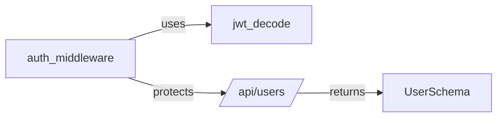
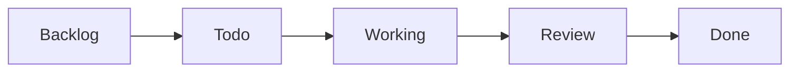
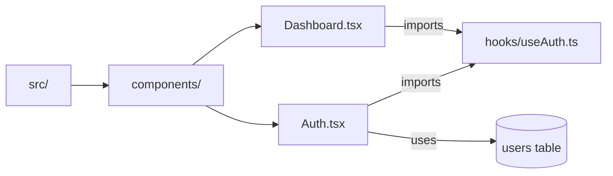
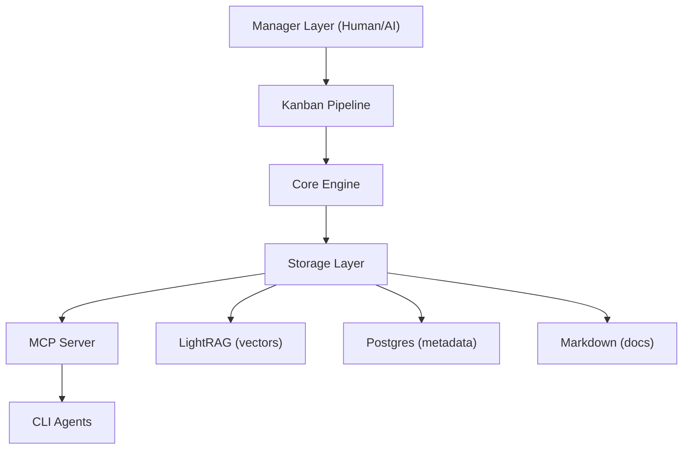

# Docrunch - under development

## Repository Intelligence & AI Orchestration System

> **Transform your codebase into a living, AI-accessible knowledge base that keeps documentation in sync with development.**

---

## What is Docrunch?

### Video Demo: https://youtu.be/uE_wNd38OFY

When you use AI coding assistants (like Claude, Gemini CLI, or Codex), they often lose track of your project's architecture, patterns, and conventions between sessions. You end up repeatedly explaining the same things, and AI-generated code becomes inconsistent with your established patterns.

**Docrunch fixes this by:**

1. **Scanning your codebase** - Analyzing files, functions, classes, and relationships
2. **Building a knowledge graph** - Creating semantic connections between code components
3. **Serving context via MCP** - Making this knowledge available to AI coding assistants
4. **Tracking AI work** - Managing tasks, progress, and completion reports
5. **Keeping everything in sync** - Updating documentation as your code evolves

---

> [!IMPORTANT] > **Prerequisites**
>
> - Python 3.11+
> - Postgres (required for MVP)
> - LightRAG (required, via Docker Compose for semantic search)
> - Redis (optional, for background jobs)

Local infra: run `docker compose up` with `docker-compose.yml` to start Postgres (5430), Redis (6370), and LightRAG in containers (no local LightRAG install). The default `.docrunch/config.yaml` URLs point to localhost on those ports.

---

## Who is Docrunch For?

| User Type               | How Docrunch Helps                                 |
| ----------------------- | -------------------------------------------------- |
| **Solo developers**     | Maintain consistent AI assistance across sessions  |
| **Teams**               | Onboard AI agents with shared context and patterns |
| **AI-heavy workflows**  | Orchestrate multiple AI agents on complex features |
| **Documentation needs** | Auto-generate and maintain up-to-date docs         |

---

## The Problem Docrunch Solves

### Without Docrunch

- Session 1: "Claude, implement auth using JWT tokens"
    - Claude creates auth/login.py with specific patterns
- Session 2: "Claude, add password reset"
    - Claude forgets the patterns from Session 1
    - Creates inconsistent code in auth/reset.py
    - You spend time explaining and correcting
- Session 3: Different AI agent, same problems...

### With Docrunch

- Session 1: "Claude, implement auth using JWT tokens"
    - Claude creates auth/login.py
    - Docrunch indexes the code and patterns
- Session 2: "Claude, add password reset"
    - Claude queries Docrunch: "What auth patterns exist?"
    - Gets context: "JWT auth in auth/login.py uses X pattern"
    - Creates consistent code that follows established patterns
- Session 3: Different agent, same context available!

---

## Core Features Explained

### Repository Scanning

Docrunch scans your entire codebase to understand its structure:

- **File tree** - Complete directory structure
- **Functions & Classes** - All code definitions with signatures
- **Imports & Exports** - Dependency relationships
- **React Components** - JSX/TSX components
- **Database Schemas** - SQL and ORM models
- **CSS Classes** - Styling definitions

**Result:** A complete map of your codebase that AI agents can query.

---

### Knowledge Graph (LightRAG)

Unlike simple search, Docrunch uses a **knowledge graph** to understand relationships:



**Why this matters:**

- AI can ask "What uses the User model?" and get connected results
- Semantic search understands meaning, not just keywords
- Pattern detection finds recurring structures in your code

Reference snapshot: `.dev/reference/LightRAG-main` (version 1.4.9.11).

---

### Bidirectional MCP (Model Context Protocol)

MCP is the standard protocol for AI tool integration. Docrunch provides:

#### **Read Operations** (AI queries context)

| What AI Can Ask           | What Docrunch Returns                      |
| ------------------------- | ------------------------------------------ |
| "How does auth work?"     | Architecture docs, related files, patterns |
| "What's the User schema?" | Database model, API endpoints using it     |
| "Show recent changes"     | Files modified, what changed, by whom      |

#### **Write Operations** (AI reports back)

| What AI Can Report | What Docrunch Does                            |
| ------------------ | --------------------------------------------- |
| "Task completed"   | Updates task status, stores completion report |
| "Found a bug"      | Logs finding, links to related files          |
| "Made a decision"  | Records as Architecture Decision Record       |

**This bidirectional flow keeps documentation in sync with actual work.**

---

### Task Orchestration (Kanban Pipeline)

Manage AI agent work like a project manager:



**Features:**

- **Task Types** - Bug fix, feature, refactor, docs, tests, security
- **Assignment** - Manual (pick agent) or Auto (smart selection)
- **Dependencies** - "Task B can't start until Task A is done"
- **Reviews** - Auto-approve simple tasks, human review for critical ones
- **Context Injection** - Each task includes relevant docs automatically

---

### LLM Settings and Chat

Configure the internal Docrunch specialists (Manager, Librarian, QA, Security, UI/UX, Chat) in the dashboard:

- Providers and specialist profiles are stored in Postgres and selected per role
- CLI Bridge enables local Gemini/Claude/Codex CLIs with optional Docker proxy
- System prompts and temperature are editable in the UI
- API keys are encrypted at rest and masked in the UI
- Chat queries docs by default, with optional reports/all scope

---

### Session Memory

Remember conversations across AI sessions:

- **Stores conversation history** - What was discussed, decided, changed
- **Injects context** - New sessions get relevant previous context
- **Cross-session search** - "What did we decide about auth last week?"

**Solves:** AI agents forgetting what happened in previous sessions.

---

### Pattern Library

Maintain consistent code patterns:

```yaml
pattern: auth-middleware
description: "How we protect API routes"
example: |
    @require_auth
    def protected_route():
        user = request.user
        ...
when_to_use:
    - "All authenticated API endpoints"
when_not_to_use:
    - "Public endpoints"
    - "Webhooks"
```

**Features:**

- **Pattern examples** - Show AI exactly how to implement
- **Anti-patterns** - Warn AI what NOT to do
- **Auto-detection** - Find where patterns are used
- **Enforcement** - Task guardrails reference patterns

---

### Cost Tracking

Monitor LLM spending:

- Today: $4.52
- This Week: $28.30
- Month: $142.00

By Agent:

- Claude: $2.15 (48%)
- Gemini: $1.89 (42%)
- OpenAI: $0.48 (10%)

Budget alert: 80% of daily limit used

**Features:**

- Real-time token tracking
- Cost per task/project
- Budget alerts
- Efficiency recommendations

---

### Git Integration

Connect with version control:

- **Auto-commit** - Documentation changes committed automatically
- **PR summaries** - Generate PR descriptions from task reports
- **Changelogs** - Auto-generate from completed tasks
- **Branch-aware** - Different docs per branch

---

### Agent Analytics

Track AI agent performance:

| Agent  | Tasks | Approval | Strengths         | Avg time | Avg cost |
| ------ | ----- | -------- | ----------------- | -------- | -------- |
| Claude | 45    | 92%      | docs/refactoring  | 12 min   | $0.18    |
| Gemini | 38    | 88%      | features/analysis | 18 min   | $0.12    |
| Codex  | 22    | 85%      | tests/quick fixes | 8 min    | $0.08    |

**Used for:**

- Smart auto-assignment (pick best agent for task type)
- Performance trends over time
- Cost efficiency comparison

---

### Rollback System

Safe recovery from mistakes:

- **Automatic snapshots** - Before every major operation
- **One-click rollback** - Restore docs, vectors, tasks
- **Diff comparison** - See what changed between versions

---

### Multi-Model Collaboration

Multiple AI agents on one feature:

Epic: Build Authentication System

- Subtask 1: DB Schema (Gemini) - DONE
- Subtask 2: API Routes (Claude) - DONE
- Subtask 3: Frontend Forms (Claude) - WORKING
- Subtask 4: Tests (Codex) - WAITING
    - Depends on: API Routes, Frontend

**Features:**

- Epic planning (break down complex work)
- Sync points (share artifacts between agents)
- Conflict detection (overlapping file changes)

---

### React Flow Visualizers

Interactive graph-based exploration of your codebase:



**Repository Graph Viewer:**

- Visualize files, functions, classes, imports, DB schemas
- **View Switcher**: Structure, Dependencies, Components, Database views
- **Drill-down**: Click nodes to explore subgraphs
- **LLM Integration**: Right-click to dispatch code for security audit, docs generation
- **Side Panel**: View code snippets, documentation, connections

**Advanced Features** ([details](./docs/components/react_flow_features.md)):

- **Diff Visualization**: See code changes between commits/branches
- **Impact Analysis**: "What breaks if I change this?"
- **Natural Language Queries**: Ask questions like "Show auth-related code"
- **Collaborative Cursors**: Real-time multi-user exploration
- **IDE Integration**: VSCode extension with live graph panel

**Additional Visualizers:**

- **Workflow Visualizer**: Real-time Temporal/Redis job monitoring
- **Knowledge Graph**: Navigate LightRAG entities and relationships
- **Data Flow Visualization**: Storage health, sync events, query tracing ([details](./docs/components/DataFlowVisualization.md))

---

### Webhooks & Notifications

Stay informed:

- **Slack/Discord** - Team notifications
- **Email** - Personal alerts
- **Webhooks** - CI/CD integration
- **Digest mode** - Hourly/daily summaries

---

## Quick Links

### Core Components

| Component       | Link                                                                       |
| --------------- | -------------------------------------------------------------------------- |
| Core Engine     | [Scanner, Parser, Analyzer, LLM](./docs/components/core-engine.md)         |
| CLI Bridge      | [Local CLI providers + proxy](./docs/components/CLI_bridge.md)             |
| Storage         | [LightRAG, Postgres, Markdown](./docs/components/storage.md)               |
| Postgres        | [Metadata Store](./docs/components/postgres.md)                            |
| Background Jobs | [Redis + Temporal](./docs/components/jobs.md)                              |
| Docker          | [Local infra stack](./docs/components/docker.md)                           |
| Chat            | [RAG Chat](./docs/components/chat.md)                                      |
| MCP Server      | [Bidirectional Protocol](./docs/components/mcp-server.md)                  |
| Task System     | [Kanban Pipeline](./docs/components/task-system.md)                        |
| CLI             | [Command Reference](./docs/components/cli.md)                              |
| Dashboard       | [React UI](./docs/components/dashboard.md)                                 |
| React Flow      | [Graph Visualizers](./docs/components/react_flow.md)                       |
| Graph Features  | [Advanced Visualization](./docs/components/react_flow_features.md)         |
| Data Flow       | [Storage & Sync Visualization](./docs/components/DataFlowVisualization.md) |
| Configuration   | [Settings & Options](./docs/components/configuration.md)                   |

### Advanced Features

| Feature         | Link                                                            |
| --------------- | --------------------------------------------------------------- |
| Session Memory  | [Conversation History](./docs/components/session-memory.md)     |
| Pattern Library | [Code Patterns](./docs/components/pattern-library.md)           |
| Cost Tracking   | [Token & Budget](./docs/components/cost-tracking.md)            |
| Git Integration | [Auto-commit, PR Summary](./docs/components/git-integration.md) |
| Agent Analytics | [Performance Tracking](./docs/components/agent-analytics.md)    |
| Rollback System | [Snapshots & Recovery](./docs/components/rollback-system.md)    |
| Multi-Model     | [Parallel Agent Work](./docs/components/multi-model.md)         |
| Webhooks        | [Notifications](./docs/components/webhooks.md)                  |

---

## Included Documents

- **Docrunch Infrastructure Implementation Roadmap — Transitioning to Hosted Production**: [Docrunch Infrastructure Implementation Roadmap — Transitioning to Hosted Production](./Docrunch%20Infrastructure%20Implementation%20Roadmap_%20Transitioning%20to%20Hosted%20Production.md) — Roadmap for moving Docrunch from a local Docker-based development setup to a production-hosted architecture; covers secure credential orchestration, transport boundaries (MCP/REST), production storage and orchestration (Postgres, LightRAG, Temporal), CLI bridge proxying, and observability/rollback procedures.

- **Docrunch: Repository Intelligence & AI Orchestration System — Briefing Document**: [Docrunch: Repository Intelligence & AI Orchestration System — Briefing Document](./Docrunch_%20Repository%20Intelligence%20%26%20AI%20Orchestration%20System%20Briefing%20Document.md) — Executive summary and project status (milestones, architecture overview, specialist roles, storage/outbox sync model, and visualization roadmap); useful for onboarding stakeholders and tracking progress.

- **Docrunch Repository Intelligence System (PDF)**: [Docrunch_Repository_Intelligence_System.pdf](./Docrunch_Repository_Intelligence_System.pdf) — Printable/packaged PDF version of the system briefing and overview for distribution or offline review.

- **Info.png**: [Info.png](./Info.png) — Project overview / visual asset (logo/diagram) used in documentation and presentations.

- **Technical Specification: Hybrid Persistence and Orchestration Architecture**: [Technical Specification: Hybrid Persistence and Orchestration Architecture](./Technical%20Specification_%20Hybrid%20Persistence%20and%20Orchestration%20Architecture.md) — Detailed technical specification describing the hybrid persistence model (Postgres as source-of-truth, LightRAG for semantic graph, Markdown docs), the Outbox Pattern for sync, and dual-layer job orchestration with Redis and Temporal.

---

## Architecture



See [architecture.md](./docs/architecture.md) for detailed technical diagrams.

---

## System Requirements

See prerequisites callout at top of document. Summary:

| Component    | Required  | Purpose                           |
| ------------ | --------- | --------------------------------- |
| Python 3.11+ | Yes       | Runtime                           |
| Postgres     | Yes (MVP) | Metadata storage                  |
| LightRAG     | Optional  | Semantic search + knowledge graph |
| Redis        | Optional  | Background jobs                   |

## Quick Start

```bash
# Install
pip install docrunch

# Initialize in your repository
cd your-project
docrunch init

# Scan and generate documentation
docrunch scan

# Offline fallback (skip Postgres/LLM)
docrunch scan --offline

# Start MCP server and Dashboard API
docrunch serve

# Query your docs
docrunch query "How does authentication work?"
```

---

## Technology Stack

| Component   | Technology       | Purpose                            |
| ----------- | ---------------- | ---------------------------------- |
| Core Engine | Python 3.11+     | Scanning, parsing, analysis        |
| AST Parsing | tree-sitter      | Multi-language code parsing        |
| Vector DB   | LightRAG         | Semantic search + knowledge graph  |
| Metadata    | Postgres         | Relational metadata + task storage |
| Jobs        | Redis + Temporal | Background workers and scheduling  |
| Protocol    | MCP SDK          | AI agent communication             |
| CLI         | Typer            | Command-line interface             |
| Dashboard   | React + Vite     | Web UI                             |

---

## Documentation Index

### Core

| Document                                                | Description                          |
| ------------------------------------------------------- | ------------------------------------ |
| [Architecture](./docs/architecture.md)                  | System design and components         |
| [Core Engine](./docs/components/core-engine.md)         | Scanner, parser, analyzer            |
| [LLM Specialists](./docs/components/llm-specialists.md) | 2-layer LLM architecture + roles     |
| [CLI Bridge](./docs/components/CLI_bridge.md)           | Local CLI providers + proxy          |
| [Storage Layer](./docs/components/storage.md)           | LightRAG, Postgres, Markdown         |
| [Postgres](./docs/components/postgres.md)               | Metadata and LLM settings store      |
| [Background Jobs](./docs/components/jobs.md)            | Redis + Temporal workers             |
| [Chat](./docs/components/chat.md)                       | RAG chat UI + endpoints              |
| [Data Sync](./docs/components/data_sync.md)             | Storage sync model                   |
| [MCP Server](./docs/components/mcp-server.md)           | Bidirectional MCP + agent config     |
| [Task System](./docs/components/task-system.md)         | Kanban pipeline and orchestration    |
| [CLI](./docs/components/cli.md)                         | Command-line interface               |
| [Dashboard](./docs/components/dashboard.md)             | React web UI                         |
| [Multi-Repository](./docs/components/multi-repo.md)     | Manage multiple repos (core feature) |
| [GitHub Auth](./docs/components/github-auth.md)         | Configuration and auth options       |
| [Configuration](./docs/components/configuration.md)     | Settings and options                 |

### Advanced Features

| Document                                                | Description                        |
| ------------------------------------------------------- | ---------------------------------- |
| [Session Memory](./docs/components/session-memory.md)   | Persistent context across sessions |
| [Pattern Library](./docs/components/pattern-library.md) | Curated code patterns              |
| [Cost Tracking](./docs/components/cost-tracking.md)     | Token usage and budgets            |
| [Git Integration](./docs/components/git-integration.md) | Auto-commit, changelogs            |
| [Agent Analytics](./docs/components/agent-analytics.md) | Performance metrics                |
| [Rollback System](./docs/components/rollback-system.md) | Snapshots and recovery             |
| [Multi-Model](./docs/components/multi-model.md)         | Parallel agent collaboration       |
| [Webhooks](./docs/components/webhooks.md)               | Notifications and integrations     |

### Reference

| Document                                           | Description                  |
| -------------------------------------------------- | ---------------------------- |
| [MVP](./docs/MVP.md)                               | Minimum viable product scope |
| [Interfaces](./docs/interfaces.md)                 | Data contracts & error codes |
| [Security](./docs/components/security.md)          | Auth, secrets, audit logging |
| [ADR: LightRAG](./docs/adr/001-lightrag-choice.md) | Why LightRAG for vectors     |
| [ADR: MCP](./docs/adr/002-mcp-protocol.md)         | Why MCP for agents           |
| [ADR: tree-sitter](./docs/adr/003-tree-sitter.md)  | Why tree-sitter for parsing  |

---

## License

MIT
