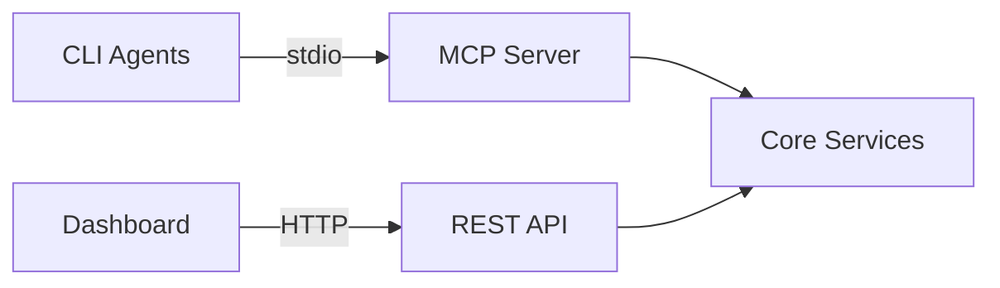

# ADR-002: MCP for AI Agent Communication

## Status

**Accepted**

## Context

Docrunch needs bidirectional communication with AI coding agents (Claude, Gemini, Codex). Agents need to query context AND report back results.

## Options Considered

| Option                           | Pros                                                         | Cons                                   |
| -------------------------------- | ------------------------------------------------------------ | -------------------------------------- |
| **MCP (Model Context Protocol)** | Industry standard, supported by Claude/others, bidirectional | Newer, less ecosystem                  |
| Custom REST API                  | Familiar, flexible                                           | Not agent-native, no tool registration |
| gRPC                             | Fast, typed                                                  | Overkill, not agent-native             |
| Direct LLM function calling      | Native to LLM                                                | Provider-specific, not portable        |

## Decision

Use **MCP** because:

1. Industry standard for AI tool integration
2. Native support in Claude CLI, growing adoption
3. Bidirectional (resources + tools) in one protocol
4. Built-in type safety with schemas

## Transport Strategy

- **stdio**: For CLI agents (Claude, Gemini, Codex)
- **HTTP**: For web dashboard (via REST wrapper)

## Fallback Plan

If MCP adoption stalls:

- REST API remains primary interface
- MCP becomes optional wrapper

## Consequences

- Dependency on `mcp` Python SDK
- Must support stdio transport for CLI agents
- HTTP/REST still needed for dashboard
