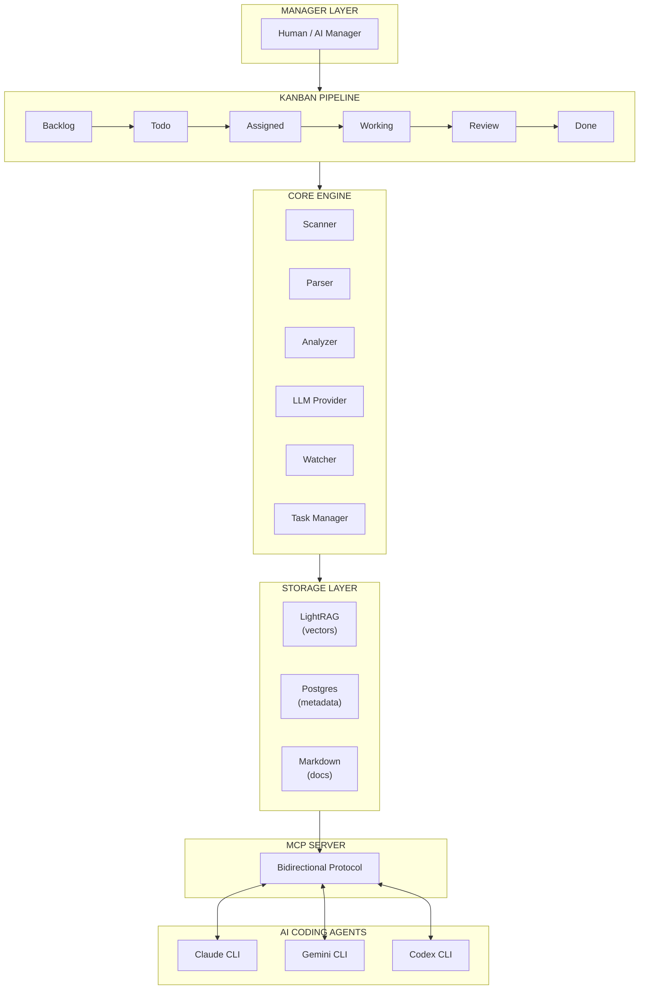
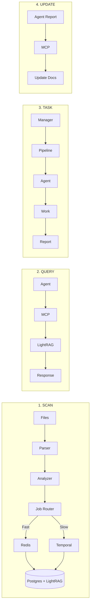

# Docrunch Architecture

## System Overview

## Component Overview

> **Detailed Documentation:** Each component has its own detailed documentation in the [components/](./components/) folder.

### 1. Manager Layer

- Human or AI manager that oversees development
- Creates and assigns tasks
- Reviews completed work
- Maintains overall direction

See [Task System](./components/task-system.md) for orchestration details

### 2. Kanban Pipeline

- Visual task tracking through stages
- Dependency management
- Priority-based review routing
- Progress tracking

See [Task System](./components/task-system.md) for pipeline configuration

### 3. Core Engine

| Component    | Purpose                          |
| ------------ | -------------------------------- |
| Scanner      | File tree and structure analysis |
| Parser       | AST parsing with tree-sitter     |
| Analyzer     | Relationship detection           |
| LLM          | AI-powered code understanding    |
| Watcher      | Real-time file monitoring        |
| Task Manager | Task lifecycle handling          |
| Job Router   | Routes tasks to Redis/Temporal   |

See [Core Engine](./components/core-engine.md) for implementation details
See [LLM Specialists](./components/llm-specialists.md) for 2-layer LLM architecture
See [CLI Bridge](./components/CLI_bridge.md) for local CLI providers and proxy mode

> **Offline Mode:** The Core Engine supports an offline fallback mode where Postgres, LightRAG, and LLM dependencies are bypassed, using local JSON cache for metadata and generating basic markdown output.

### 4. Storage Layer

| Store    | Purpose                           |
| -------- | --------------------------------- |
| LightRAG | Semantic search + knowledge graph |
| Postgres | Metadata and task storage         |
| Markdown | Human-readable documentation      |

See [Storage](./components/storage.md) for schemas and APIs

See [Data Sync](./components/data_sync.md) for storage synchronization

See [Data Flow Visualization](./components/DataFlowVisualization.md) for storage, sync, and query flow monitoring

Background jobs for sync and scheduled scans run via Redis/Dramatiq (fast tasks) and Temporal (durable workflows). The **Job Router** intelligently routes tasks between these backends based on duration and complexity. See [Background Jobs](./components/jobs.md).

### 5. MCP Server

- Bidirectional communication
- Query tools (AI reads context)
- Report tools (AI writes back)

See [MCP Server](./components/mcp-server.md) for protocol specification

See [API Transport](./components/api-transport.md) for REST vs MCP boundaries

### 6. AI Agents

- Claude CLI, Gemini CLI, Codex
- Connect via **CLI Bridge** provider (local or proxy mode)
- Receive tasks, report completion via MCP

See [CLI](./components/cli.md) for agent configuration

See [Mocking](./components/mocking.md) for parallel development

### 7. Dashboard UI

- React dashboard consumes REST + WebSocket APIs
- React Flow visualizers: Repository Graph, Workflow Visualizer, Knowledge Graph, Data Flow
- See [Dashboard](./components/dashboard.md), [React Flow Visualizers](./components/react_flow.md), and [Data Flow Visualization](./components/DataFlowVisualization.md)

## Data Flow

## Design Decisions

| Decision  | Choice           | Rationale                         |
| --------- | ---------------- | --------------------------------- |
| Vector DB | LightRAG         | Knowledge graph for relationships |
| Metadata  | Postgres         | Relational, concurrent, scalable  |
| LLM       | Configurable     | Flexibility for different models  |
| Parsing   | tree-sitter      | Multi-language, fast, accurate    |
| Protocol  | MCP              | Standard for AI tool integration  |
| Jobs      | Dramatiq + Redis | Background workers and scheduling |

See [ADRs](./adr/) for detailed decision records

---

## Advanced Features

| Feature             | Description                                     | Documentation                                         |
| ------------------- | ----------------------------------------------- | ----------------------------------------------------- |
| **Session Memory**  | Persistent conversation history across sessions | [session-memory.md](./components/session-memory.md)   |
| **Pattern Library** | Curated code patterns with examples             | [pattern-library.md](./components/pattern-library.md) |
| **Cost Tracking**   | LLM token usage and budget management           | [cost-tracking.md](./components/cost-tracking.md)     |
| **Git Integration** | Auto-commit, PR summaries, changelogs           | [git-integration.md](./components/git-integration.md) |
| **Agent Analytics** | Performance tracking per agent/task type        | [agent-analytics.md](./components/agent-analytics.md) |
| **Rollback System** | Snapshots and one-click recovery                | [rollback-system.md](./components/rollback-system.md) |
| **Multi-Model**     | Parallel agent collaboration on epics           | [multi-model.md](./components/multi-model.md)         |
| **Webhooks**        | Slack, Discord, email notifications             | [webhooks.md](./components/webhooks.md)               |
