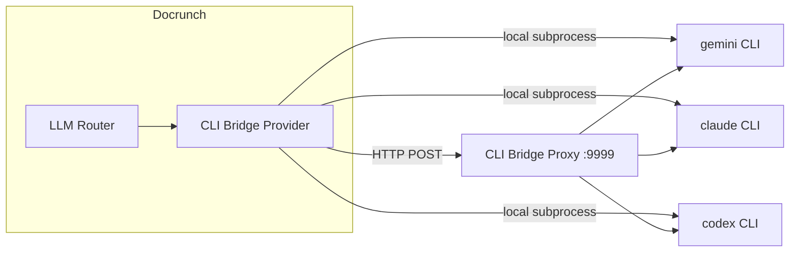

# CLI Bridge

Use locally installed LLM CLI tools (Gemini, Claude, Codex) as Docrunch providers. Supports direct subprocess execution or an HTTP proxy to reach host CLIs from Docker.

## Overview

- Provider type: `cli_bridge`
- Supported CLI tools: Gemini CLI, Claude CLI, Codex CLI
- Modes: local subprocess or proxy (Docker tunnel)
- CLI models list stored in `.docrunch/cli_models.json`

---

## Architecture



---

## Backend Provider (cli_bridge)

Responsibilities:
- Execute CLI tools with STDIN prompt input
- Support proxy mode for Docker
- Parse CLI output into response text or JSON
- Provide health checks and clear error messages

### Config schema

```
provider_type: cli_bridge
config:
  cli_type: gemini | claude | codex
  executable_path: <optional path>
  proxy_url: <optional http url>
  proxy_api_key: <optional api key>
  timeout: <seconds, default 120>
  cache_responses: <bool>
```

Example:

```json
{
  "name": "CLI Gemini",
  "provider_type": "cli_bridge",
  "config": {
    "cli_type": "gemini",
    "proxy_url": "http://host.docker.internal:9999",
    "proxy_api_key": "mysecret",
    "timeout": 120
  }
}
```

### Execution details

- Prompt is built as simple role-labeled text:

```
System: ...
User: ...
Assistant: ...
```

- Always send prompt via STDIN (avoid Windows 8191 char limit)
- Ensure trailing newline on STDIN to prevent Gemini hang
- Use `subprocess.run` in a thread pool (Windows compatibility)
- Parse fenced code blocks; if output includes ```json, extract JSON

### CLI command shapes

- Gemini: `gemini --model <model>` (prompt via STDIN)
- Claude: `claude -p --model <model>` (use short "sonnet" when needed)
- Codex: `codex exec --model <model>`

### Executable discovery

- Search `PATH` first (`shutil.which`)
- Fallback to common install locations:
  - `AppData\Roaming\npm\*.cmd`
  - `AppData\Local\...\*.exe`
  - `.local/bin`
  - `/usr/local/bin`
- If not found, return actionable error (install CLI or set `executable_path`)

### Health checks

- Local: `<executable> --version` with 5s timeout
- Proxy: `GET /health` and per-CLI availability flags

---

## CLI Bridge Proxy (host-side)

Runs on the host machine and relays requests from Dockerized Docrunch.

### Endpoints

- `GET /health`
  - Returns `gemini_available`, `claude_available`, `codex_available`, and paths
- `POST /execute`
  - Body: `{ cli_type, prompt, model, timeout }`
  - Header: `X-API-Key` when configured
  - Response: `{ success, content, error, cli_type, model, execution_time_ms }`

### Startup

```bash
python scripts/cli_proxy.py --host 0.0.0.0 --port 9999
# Optional API key
python scripts/cli_proxy.py --api-key mysecret
```

Docker access: `http://host.docker.internal:9999`

### Environment defaults

- `CLI_PROXY_URL`
- `CLI_PROXY_API_KEY`

---

## CLI Models Registry

File: `.docrunch/cli_models.json`

Shape:

```json
{
  "gemini": {
    "description": "Google Gemini CLI models",
    "models": [
      { "id": "gemini-2.5-flash", "name": "Gemini 2.5 Flash", "description": "High performance" }
    ]
  },
  "claude": {
    "description": "Anthropic Claude CLI models",
    "models": [
      { "id": "sonnet", "name": "Claude Sonnet", "description": "Balanced" }
    ]
  },
  "codex": {
    "description": "OpenAI Codex CLI models",
    "models": [
      { "id": "gpt-5.2-codex", "name": "GPT-5.2 Codex", "description": "Agentic coding" }
    ]
  }
}
```

---

## API Surface (suggested)

- `GET /api/llm/cli-models`
- `GET /api/llm/cli-models/{cli_type}`
- `PUT /api/llm/cli-models/{cli_type}`
- `POST /api/llm/cli-models/{cli_type}/models`
- `DELETE /api/llm/cli-models/{cli_type}/models/{model_id}`

Provider-specific model list:
- `GET /api/llm/providers/{id}/models` returns the CLI models for that provider's `cli_type`.

---

## UI Requirements

- Add Provider modal:
  - Show "CLI Bridge" type
  - Add `CLI Tool` selector (gemini/claude/codex)
  - Auto-name: `CLI Gemini`, `CLI Claude`, `CLI Codex`
- Provider cards:
  - Test button calls provider health check
  - Show errors when CLI missing or login required
- CLI Models tab:
  - Tabs per CLI type
  - Add/Delete models
  - Writes to `.docrunch/cli_models.json`
- Specialists:
  - Model dropdown from `GET /api/llm/providers/{id}/models`
  - Allow manual model input

---

## Router Behavior

- Respect specialist selection: when a role uses a CLI Bridge provider, do not silently fall back to other providers
- Use fallback chain only when no specialist is configured for the role

---

## Error Handling Notes

- Missing CLI executable: prompt user to install CLI or set `executable_path`
- Auth errors: instruct `<cli> login` on host
- Model not found: update `.docrunch/cli_models.json` or use a valid model
- Timeouts: surface timeout and allow per-provider override
