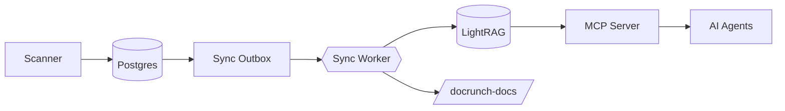
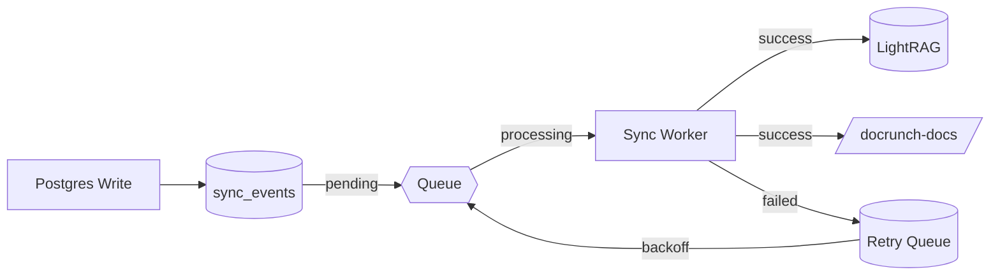
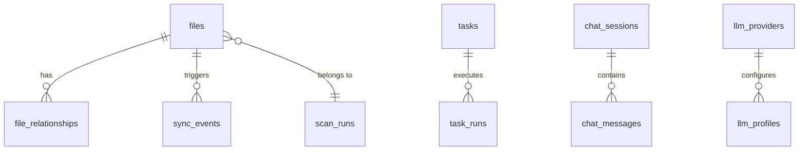
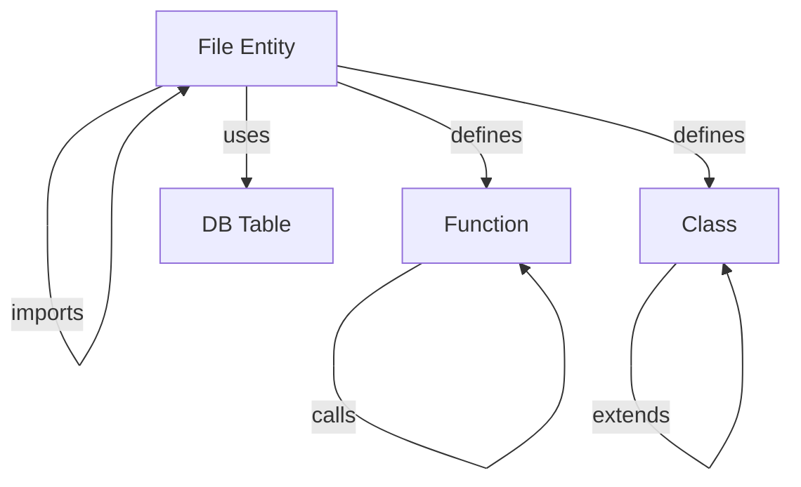
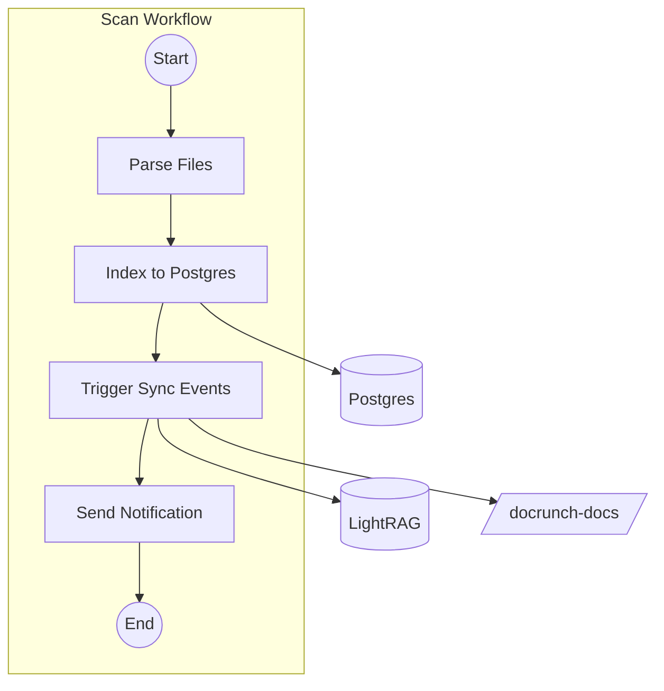
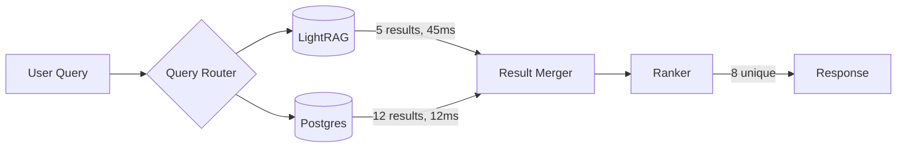

# Data Flow Visualization

> React Flow components for visualizing data movement across Docrunch storage backends.

---

## Overview

Docrunch uses multiple storage backends that work together:

| Storage      | Purpose                          | Data Type          |
| ------------ | -------------------------------- | ------------------ |
| **Postgres** | Metadata, tasks, settings        | Relational records |
| **LightRAG** | Semantic search, knowledge graph | Vectors, entities  |
| **Redis**    | Job queues, caching              | Ephemeral state    |
| **Temporal** | Durable workflows                | Workflow state     |
| **Markdown** | Documentation output             | Generated files    |

The Data Flow Visualization features provide interactive React Flow graphs to understand how data moves between these systems.

---

## Features

### 1. Data Lineage Graph (TASK-088)

Visualize the complete data flow from scan to output:



**Node Types:**

-   `source`: Scanner, external input
-   `storage`: Postgres, LightRAG, Redis, Temporal
-   `processor`: Sync Worker, LLM specialists
-   `output`: Markdown files, MCP responses

**Edge Types:**

-   `write`: Data being stored
-   `read`: Data being queried
-   `sync`: Async propagation via outbox

**Interactions:**

-   Click storage node -> view entity counts and health
-   Click edge -> view recent events on that path
-   Toggle live mode -> animate events in real-time

**API Endpoints:**

```
GET /api/system/lineage          # Graph structure
GET /api/system/lineage/events   # Recent events
WS  /ws/system/lineage           # Live event stream
```

---

### 2. Storage Health Dashboard (TASK-089)

Visual health status of all storage backends as a React Flow graph.

**Example Node:**

```
[db] Postgres
status: healthy
records: 12450
latency_ms: 12
last_query: 2s ago
```

**Health States:**

-   `healthy`: Connected, responding within SLA
-   `degraded`: High latency or partial issues
-   `down`: Connection failed or timeout
-   `unknown`: Not yet checked

**Features:**

-   Auto-refresh every 30 seconds
-   Manual refresh button
-   Click for detailed metrics panel
-   Historical uptime graph in side panel

**API Endpoints:**

```
GET /api/system/health           # All backends health
GET /api/system/health/:backend  # Specific backend details
```

---

### 3. Sync Event Visualizer (TASK-090)

Real-time visualization of the outbox sync pattern:



**Event States:**

-   **Pending** (yellow): Waiting in outbox
-   **Processing** (blue): Currently being synced
-   **Success** (green): Completed, removed from outbox
-   **Failed** (red): Error, will retry
-   **Dead Letter** (gray): Max retries exceeded

**Live Animation:**

-   Events flow through the graph in real-time
-   Pulse animation on active nodes
-   Edge highlights during transfers

**Interactions:**

-   Click pending event -> view payload, manually retry
-   Click failed event -> view error, edit and retry
-   Filter by event type (file_indexed, relationship_created, etc.)
-   Pause/resume live updates

**API Endpoints:**

```
GET  /api/sync/events            # List events with status
POST /api/sync/events/:id/retry  # Manual retry
WS   /ws/sync/events             # Live event stream
```

---

### 4. Entity Location Map (TASK-091)

Show where a single entity exists across all storage backends.

**Example: `auth/login.py`**

```
entity: auth/login.py
- postgres: present (v3)
- lightrag: present (5 relationships)
- markdown: present (login.md)
```

**Status Indicators:**

-   `present`: Entity exists in storage
-   `missing`: Not yet synced
-   `stale`: Outdated version
-   `pending`: Sync in progress

**Features:**

-   Search for any entity by name or path
-   View sync history for each storage
-   One-click sync to missing storages
-   Compare versions across storages

**API Endpoints:**

```
GET  /api/entities/:id/locations       # Where entity exists
POST /api/entities/:id/sync/:backend   # Trigger sync to specific backend
```

---

### 5. Schema Visualization (TASK-092)

#### Postgres Schema Graph

Display database tables as nodes with foreign key edges:



**Node Content:**

-   Table name and icon
-   Column count badge
-   Row count estimate
-   Click to expand column list

**Interactions:**

-   Hover table -> show columns tooltip
-   Click table -> open column list in side panel
-   Click FK edge -> show relationship details
-   Filter: Show only tables with data / empty tables

#### LightRAG Entity Schema

Visualize entity types and their semantic relationships:



**Features:**

-   Node size = entity count
-   Edge thickness = relationship frequency
-   Click entity type -> list all entities of that type
-   Query builder: "Show Files that import X"

**API Endpoints:**

```
GET  /api/schema/postgres         # Tables and relationships
GET  /api/schema/lightrag         # Entity types and counts
POST /api/schema/lightrag/query   # Custom entity queries
```

---

### 6. Job & Workflow Data Flow (TASK-093)

Combine Temporal workflow visualization with data storage touchpoints:



**Features:**

-   Workflow steps as horizontal swim lane
-   Storage nodes positioned below workflow
-   Edges connect activities to data writes/reads
-   Real-time: highlight currently executing step
-   Completed storages show checkmark

**Interactions:**

-   Click activity -> view input/output
-   Click storage -> view what this workflow wrote
-   Replay: step through historical workflow execution
-   Compare: show two workflow runs side by side

**API Endpoints:**

```
GET /api/workflows/:id/dataflow   # Workflow with storage edges
WS  /ws/workflows/:id             # Live workflow updates
```

---

### 7. Cross-Storage Diff View (TASK-094)

Find and visualize inconsistencies between storage backends.

**Diff Table:**

| Entity            | Postgres   | LightRAG   | Markdown   | Status   |
| ----------------- | ---------- | ---------- | ---------- | -------- |
| `auth/login.py`   | present v3 | present v3 | missing    | missing  |
| `db/models.py`    | present v5 | stale v4   | present v5 | stale    |
| `utils/format.py` | present v2 | present v2 | present v2 | in_sync  |

**React Flow Representation:**

-   Storage nodes show per-backend status badges
-   Edges highlight which storage is out of sync
-   Hover nodes to see version counts and timestamps

**Sync Status:**

-   `in_sync`: All storages have same version
-   `stale`: Some storages have older versions
-   `missing`: Some storages do not have entity

**Actions:**

-   Select entities -> bulk sync
-   Filter by status (show only out-of-sync)
-   Schedule automatic sync for stale items
-   View sync history and failure reasons

**API Endpoints:**

```
GET  /api/sync/diff          # All entities with sync status
POST /api/sync/diff/resolve  # Bulk sync selected entities
GET  /api/sync/diff/stats    # Summary counts by status
```

---

### 8. Query Execution Visualizer (TASK-095)

Trace how a query (from Chat or MCP) traverses storage backends.

**Example Query: "What files import authentication?"**



**Trace Information:**

-   Which backends were queried
-   Latency per backend
-   Results count per backend
-   How results were merged and ranked

**Features:**

-   Query history with traces
-   Click any query to see full trace
-   Compare performance across queries
-   Identify slow storage backends
-   Optimize: suggest which backend to query

**Live Mode:**

-   Watch queries in real-time
-   Highlight currently executing step
-   Show result counts as they arrive

**API Endpoints:**

```
GET /api/queries/trace/:id   # Trace for completed query
WS  /ws/queries              # Live query stream
GET /api/queries/stats       # Performance summary
```

---

## Implementation Architecture

### Shared Components

All Data Flow visualizations share common components:

```
web/src/components/dataflow/
  DataFlowCanvas.tsx       # Base React Flow canvas
  StorageNode.tsx          # Postgres, LightRAG, Redis nodes
  ProcessorNode.tsx        # Workers, routers
  DataEdge.tsx             # Animated data flow edges
  HealthBadge.tsx          # Status indicators
  LiveToggle.tsx           # Real-time updates toggle
  TracePanel.tsx           # Side panel for traces
```

### Backend Requirements

```
docrunch/api/
  system.py                # /api/system/* endpoints
  sync.py                  # /api/sync/* endpoints
  schema.py                # /api/schema/* endpoints
  entities.py              # /api/entities/* endpoints
  workflows.py             # /api/workflows/* endpoints
  queries.py               # /api/queries/* endpoints

docrunch/api/websocket/
  lineage_events.py        # WebSocket for lineage events
  sync_events.py           # WebSocket for sync events
  workflow_events.py       # WebSocket for workflow updates
  query_trace.py           # WebSocket for live queries
```

---

## Related Documentation

-   [React Flow Core](./react_flow.md) - Base visualizer documentation
-   [React Flow Advanced Features](./react_flow_features.md) - Analysis and collaboration features
-   [Data Sync](./data_sync.md) - Outbox pattern implementation
-   [Storage Layer](./storage.md) - Storage backend details
-   [Jobs](./jobs.md) - Redis and Temporal workers
