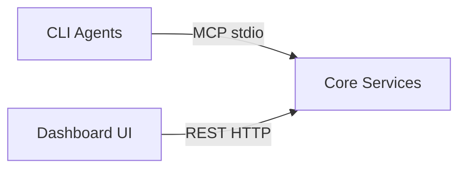

# API Layer & Transport Boundaries

## Overview

Docrunch exposes its functionality through two transports:

| Transport | Protocol | Clients                             |
| --------- | -------- | ----------------------------------- |
| **MCP**   | stdio    | CLI agents (Claude, Gemini, Codex)  |
| **REST**  | HTTP     | Dashboard UI, external integrations |

Both transports call the **same core services** - they are facades, not separate systems.

---

## Architecture



**Key Point:** MCP and REST run in the **same process** and share the core service layer.

---

## Transport Details

### MCP (Model Context Protocol)

**Purpose:** AI coding agents query context and report work.

**Transport:** stdio (standard input/output)

**Start Command:**

```bash
docrunch serve --stdio
```

MCP over HTTP is optional and configured via `server.mcp.transport: http` and
`server.mcp.host`/`server.mcp.port` (use a separate port from REST).

**Connection (Claude CLI example):**

```json
{
  "mcpServers": {
    "docrunch": {
      "command": "docrunch",
      "args": ["serve", "--stdio"]
    }
  }
}
```

**Features:**

- Resources (list/read documentation)
- Tools (search, get_component, report)

### REST API

**Purpose:** Dashboard UI and external HTTP clients.

**Transport:** HTTP on configurable port (default 3333)

**Start Command:**

```bash
docrunch serve --http
# Or both:
docrunch serve --stdio --http
```

**Base URL:** `http://localhost:3333/api` (all REST endpoints are under `/api`).

**Endpoints:**

| Method | Endpoint                           | Description                         |
| ------ | ---------------------------------- | ----------------------------------- | ------- | ---- |
| GET    | `/api/health`                      | Health check                        |
| GET    | `/api/search`                      | Search docs and reports (scope=docs | reports | all) |
| GET    | `/api/modules`                     | List modules                        |
| GET    | `/api/modules/{name}`              | Module details                      |
| GET    | `/api/functions/{name}`            | Function details                    |
| GET    | `/api/graph`                       | Knowledge graph data                |
| GET    | `/api/tasks`                       | List tasks                          |
| GET    | `/api/tasks/{id}`                  | Task details                        |
| PATCH  | `/api/tasks/{id}`                  | Update task                         |
| GET    | `/api/llm/providers`               | List LLM providers                  |
| POST   | `/api/llm/providers`               | Create LLM provider                 |
| PATCH  | `/api/llm/providers/{id}`          | Update LLM provider                 |
| GET    | `/api/llm/providers/{id}/models`   | List provider models                |
| POST   | `/api/llm/providers/{id}/models`   | Add provider model                  |
| GET    | `/api/llm/cli-models`              | List all CLI model sets             |
| GET    | `/api/llm/cli-models/{cli_type}`   | Get CLI models for a type           |
| PUT    | `/api/llm/cli-models/{cli_type}`   | Replace CLI models for a type       |
| POST   | `/api/llm/cli-models/{cli_type}/models` | Add CLI model                   |
| DELETE | `/api/llm/cli-models/{cli_type}/models/{model_id}` | Delete CLI model |
| GET    | `/api/llm/profiles`                | List LLM profiles                   |
| GET    | `/api/llm/profiles/{role}`         | Get LLM profile                     |
| PATCH  | `/api/llm/profiles/{role}`         | Update LLM profile                  |
| GET    | `/api/chat/sessions`               | List chat sessions                  |
| POST   | `/api/chat/sessions`               | Create chat session                 |
| GET    | `/api/chat/sessions/{id}/messages` | List messages                       |
| POST   | `/api/chat/sessions/{id}/messages` | Send message + response             |

Auth endpoints are planned (Phase 4+). In MVP/local dev, REST endpoints are
unauthenticated; secure them via localhost binding or an external auth proxy.

---

## Service Layer

Both transports delegate to shared services:

```python
# Shared services (used by both MCP and REST)
class DocrunchServices:
    def __init__(self):
        self.storage = StorageHub()
        self.scanner = Scanner()
        self.query = QueryEngine()

    async def search(self, query: str, scope: str = "docs") -> list[Result]:
        """Used by MCP search_docs and REST /api/search"""
        return await self.query.search(query, scope=scope)

    async def get_module(self, name: str) -> Module:
        """Used by MCP get_component and REST /api/modules/{name}"""
        return await self.storage.get_module(name)

# MCP adapter
@mcp_server.tool()
async def search_docs(query: str, scope: str = "docs"):
    return await services.search(query, scope=scope)

# REST adapter
@app.get("/api/search")
async def api_search(query: str, scope: str = "docs"):
    return await services.search(query, scope=scope)
```

---

## Configuration

```yaml
server:
  # HTTP settings (REST API for dashboard + integrations)
  http:
    enabled: true
    host: localhost
    port: 3333
    base_path: /api
    cors_origins:
      - http://localhost:5173
      - http://localhost:3000

  # MCP settings
  mcp:
    enabled: true
    transport: stdio # stdio or http
    host: localhost # used only for http transport
    port: 3334 # use a separate port from REST
```

---

## When to Use Which

| Use Case                      | Transport   |
| ----------------------------- | ----------- |
| Claude/Gemini CLI integration | MCP (stdio) |
| Dashboard UI                  | REST (HTTP) |
| CI/CD webhooks                | REST (HTTP) |
| Custom scripts                | REST (HTTP) |
| IDE extensions                | Either      |
