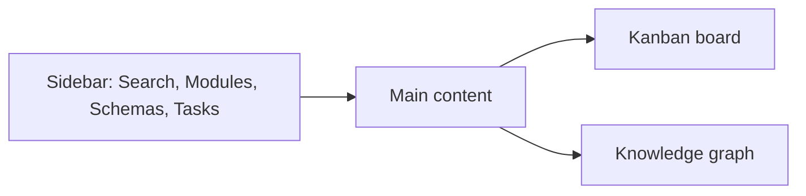

# React Dashboard

Web UI for browsing documentation, viewing knowledge graphs, and managing tasks.

## Overview



## Technology Stack

| Tech                | Purpose             |
| ------------------- | ------------------- |
| React 18            | UI Framework        |
| Vite                | Build tool          |
| TypeScript          | Type safety         |
| TanStack Query      | Data fetching       |
| D3.js / vis-network | Graph visualization |
| Tailwind CSS        | Styling             |
| React Router        | Navigation          |

---

## Project Structure

```
web/
- src/
  - components/
    - Layout/
      - Sidebar.tsx
      - Header.tsx
      - Layout.tsx
    - KanbanBoard/
      - Board.tsx
      - Column.tsx
      - TaskCard.tsx
    - KnowledgeGraph/
      - Graph.tsx
      - Node.tsx
      - Controls.tsx
    - Search/
      - SearchBar.tsx
      - Results.tsx
    - Documentation/
      - ModuleView.tsx
      - FunctionView.tsx
      - MarkdownRenderer.tsx
    - Tasks/
      - TaskDetail.tsx
      - TaskForm.tsx
      - TaskHistory.tsx
  - pages/
    - Dashboard.tsx
    - Modules.tsx
    - Tasks.tsx
    - Graph.tsx
    - Settings.tsx
  - hooks/
    - useSearch.ts
    - useTasks.ts
    - useGraph.ts
  - api/
    - client.ts
  - types/
    - index.ts
  - App.tsx
  - main.tsx
- package.json
- vite.config.ts
- tailwind.config.js
- tsconfig.json
```

---

## Key Components

### Kanban Board

Drag-and-drop task management board.

```tsx
// components/KanbanBoard/Board.tsx
import { DndContext, DragEndEvent } from "@dnd-kit/core";

export function Board() {
  const { tasks, updateTaskStatus } = useTasks();

  const columns = [
    { id: "backlog", title: "Backlog" },
    { id: "todo", title: "Todo" },
    { id: "working", title: "Working" },
    { id: "review", title: "Review" },
    { id: "done", title: "Done" },
  ];

  const handleDragEnd = (event: DragEndEvent) => {
    const { active, over } = event;
    if (over) {
      updateTaskStatus(active.id, over.id);
    }
  };

  return (
    <DndContext onDragEnd={handleDragEnd}>
      <div className="flex gap-4">
        {columns.map((col) => (
          <Column
            key={col.id}
            column={col}
            tasks={tasks.filter((t) => t.status === col.id)}
          />
        ))}
      </div>
    </DndContext>
  );
}
```

### Knowledge Graph

Interactive graph visualization using D3.js or vis-network.

```tsx
// components/KnowledgeGraph/Graph.tsx
import { useEffect, useRef } from "react";
import { Network } from "vis-network";

export function KnowledgeGraph({ data }) {
  const containerRef = useRef<HTMLDivElement>(null);

  useEffect(() => {
    if (!containerRef.current) return;

    const network = new Network(
      containerRef.current,
      {
        nodes: data.nodes,
        edges: data.edges,
      },
      {
        physics: {
          enabled: true,
          solver: "forceAtlas2Based",
        },
        nodes: {
          shape: "dot",
          size: 16,
        },
        edges: {
          arrows: "to",
          smooth: true,
        },
      }
    );

    network.on("click", (params) => {
      if (params.nodes.length > 0) {
        onNodeClick(params.nodes[0]);
      }
    });

    return () => network.destroy();
  }, [data]);

  return <div ref={containerRef} className="h-full w-full" />;
}
```

### Search

Semantic search with highlighted results. UI can scope to docs, reports, or all (default docs).

```tsx
// components/Search/SearchBar.tsx
import { useState } from "react";
import { useSearch } from "@/hooks/useSearch";

export function SearchBar() {
  const [query, setQuery] = useState("");
  const { results, isLoading } = useSearch(query);

  return (
    <div className="relative">
      <input
        type="text"
        value={query}
        onChange={(e) => setQuery(e.target.value)}
        placeholder="Search documentation..."
        className="w-full px-4 py-2 border rounded-lg"
      />

      {results.length > 0 && (
        <div className="absolute top-full mt-2 w-full bg-white shadow-lg rounded-lg">
          {results.map((result) => (
            <SearchResult key={result.id} result={result} />
          ))}
        </div>
      )}
    </div>
  );
}
```

### Chat

User-facing chat to query documentation and RAG context.

```tsx
// components/Chat/ChatPanel.tsx
import { useState } from "react";
import { sendChatMessage } from "@/api/client";

export function ChatPanel({ sessionId }) {
  const [input, setInput] = useState("");
  const [messages, setMessages] = useState([]);

  async function onSend() {
    const response = await sendChatMessage(sessionId, input, "docs");
    setMessages((prev) => [...prev, { role: "user", content: input }, response]);
    setInput("");
  }

  return (
    <div className="flex h-full flex-col">
      <div className="flex-1 overflow-y-auto">{/* render messages */}</div>
      <div className="flex gap-2">
        <input value={input} onChange={(e) => setInput(e.target.value)} />
        <button onClick={onSend}>Send</button>
      </div>
    </div>
  );
}
```

---

## API Integration

### Client Setup

```typescript
// api/client.ts
const API_BASE = "http://localhost:3333/api";

type ApiResponse<T> = {
  success: boolean;
  data: T | null;
  error: { code: string; message: string } | null;
};

async function unwrap<T>(res: Response): Promise<T> {
  const payload = (await res.json()) as ApiResponse<T>;
  if (!payload.success || payload.data === null) {
    throw new Error(payload.error?.message || "Request failed");
  }
  return payload.data;
}

export async function searchDocs(query: string, scope: "docs" | "reports" | "all" = "docs") {
  const res = await fetch(
    `${API_BASE}/search?query=${encodeURIComponent(query)}&scope=${scope}`
  );
  return unwrap(res);
}

export async function getTasks(status?: string) {
  const url = status
    ? `${API_BASE}/tasks?status=${status}`
    : `${API_BASE}/tasks`;
  const res = await fetch(url);
  return unwrap(res);
}

export async function updateTaskStatus(taskId: string, status: string) {
  const res = await fetch(`${API_BASE}/tasks/${taskId}`, {
    method: "PATCH",
    headers: { "Content-Type": "application/json" },
    body: JSON.stringify({ status }),
  });
  return unwrap(res);
}

export async function getGraph() {
  const res = await fetch(`${API_BASE}/graph`);
  return unwrap(res);
}

export async function listProviders() {
  const res = await fetch(`${API_BASE}/llm/providers`);
  return unwrap(res);
}

export async function listModels(providerId: string) {
  const res = await fetch(`${API_BASE}/llm/providers/${providerId}/models`);
  return unwrap(res);
}

export async function getProfiles() {
  const res = await fetch(`${API_BASE}/llm/profiles`);
  return unwrap(res);
}

export async function updateProfile(role: string, payload: unknown) {
  const res = await fetch(`${API_BASE}/llm/profiles/${role}`, {
    method: "PATCH",
    headers: { "Content-Type": "application/json" },
    body: JSON.stringify(payload),
  });
  return unwrap(res);
}

export async function sendChatMessage(
  sessionId: string,
  message: string,
  scope: "docs" | "reports" | "all" = "docs"
) {
  const res = await fetch(`${API_BASE}/chat/sessions/${sessionId}/messages`, {
    method: "POST",
    headers: { "Content-Type": "application/json" },
    body: JSON.stringify({ message, scope }),
  });
  return unwrap(res);
}
```

### React Query Hooks

```typescript
// hooks/useTasks.ts
import { useQuery, useMutation, useQueryClient } from "@tanstack/react-query";
import { getTasks, updateTaskStatus } from "@/api/client";

export function useTasks(status?: string) {
  const queryClient = useQueryClient();

  const query = useQuery({
    queryKey: ["tasks", status],
    queryFn: () => getTasks(status),
  });

  const mutation = useMutation({
    mutationFn: ({ taskId, status }) => updateTaskStatus(taskId, status),
    onSuccess: () => {
      queryClient.invalidateQueries({ queryKey: ["tasks"] });
    },
  });

  return {
    tasks: query.data ?? [],
    isLoading: query.isLoading,
    updateTaskStatus: (taskId: string, status: string) =>
      mutation.mutate({ taskId, status }),
  };
}
```

---

## Pages

### Dashboard

- Overview stats (files, tasks, agents)
- Recent activity
- Quick search

### Modules

- Browse documentation by module
- View function details
- See relationships

### Tasks

- Full Kanban board
- Task creation
- History and reports

### Graph

- Full-screen knowledge graph
- Filtering by type
- Node details panel

### Chat

- Chat sessions list
- RAG-powered answers with citations
- Scope selector (docs, reports, all)

### Settings

- LLM provider configuration (including CLI Bridge fields)
- CLI Models tab for Gemini/Claude/Codex (CLI Bridge)
- Specialist profile cards (Manager, Librarian, QA, Security, UI/UX, Chat, Analyzer)
- Editable system prompts and temperature per profile
- Review rules
- Ignore patterns
