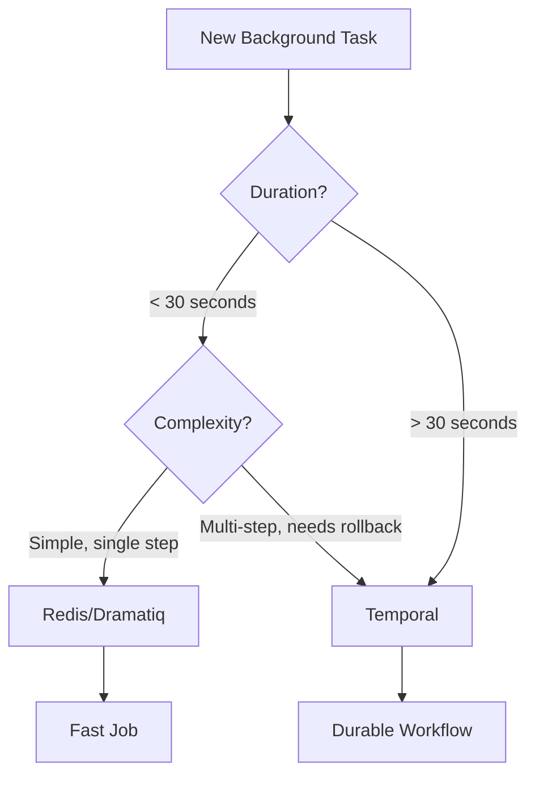
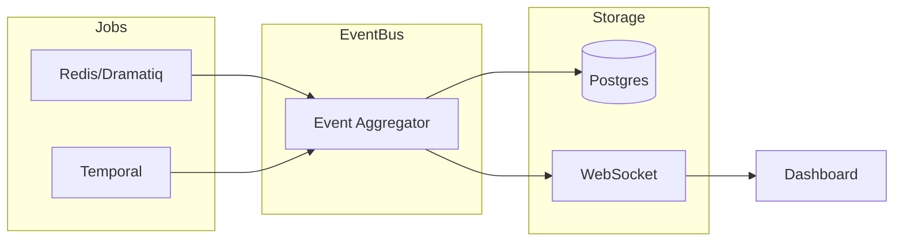

# Background Jobs: Redis + Temporal

Docrunch uses a **2-layer queued work system** to handle background tasks efficiently:

| Layer             | Technology       | Best For                        | Latency         |
| ----------------- | ---------------- | ------------------------------- | --------------- |
| **Fast Queue**    | Redis + Dramatiq | High-volume, short tasks (<30s) | Sub-second      |
| **Durable Queue** | Temporal         | Long-running, complex workflows | Minutes to days |

---

## When to Use Which Layer



### Use Redis/Dramatiq When:

-   Task completes in seconds (sync events, embeddings, file indexing)
-   High frequency, high volume (thousands/minute)
-   Failure = retry is acceptable (no complex compensation)
-   Transient data that can be lost without catastrophe

### Use Temporal When:

-   Task takes minutes, hours, or days (full repo scans, multi-step AI analysis)
-   Process must survive server restarts and crashes
-   Need Saga pattern (if Step B fails, rollback Step A)
-   Complex state machine with human-in-the-loop approvals
-   Must guarantee exactly-once execution

---

## Layer 1: Redis + Dramatiq (Fast Queue)

Redis is the broker for Dramatiq background jobs.

### Configuration

```yaml
jobs:
    backend: dramatiq
    broker: redis
    redis_url: redis://localhost:6370/0
    queue_name: docrunch
    poll_interval_seconds: 5
    scheduler:
        enabled: true
        driver: dramatiq_cron
        scan_cron: "0 */6 * * *"
        sync_cron: "*/5 * * * *"
```

### Job Actors

| Actor            | Queue      | Purpose                        |
| ---------------- | ---------- | ------------------------------ |
| `sync_event`     | default    | Process storage sync events    |
| `embed_file`     | embeddings | Generate embeddings for a file |
| `index_file`     | indexing   | Update file in Postgres index  |
| `publish_report` | reports    | Publish completed task reports |

### Failure Handling

-   Jobs are idempotent and replay-safe
-   Retries use Dramatiq retry middleware (exponential backoff)
-   Redis outages fall back to in-process workers for local dev

### Middleware

Dramatiq middleware emits lifecycle events for dashboard visualization:

```python
# Event payload example
{
    "source": "dramatiq",
    "event": "job_started",
    "jobId": "job-42",
    "queue": "embeddings",
    "meta": {"file": "src/foo.py"},
    "timestamp": "2025-12-31T12:10:00Z"
}
```

---

## Layer 2: Temporal (Durable Queue)

Temporal handles long-running, complex workflows with guaranteed execution.

### Configuration

```yaml
temporal:
    server_url: localhost:7233
    namespace: docrunch
    task_queue: docrunch-workflows
    worker_count: 2
```

### Core Workflows

| Workflow                    | Duration   | Purpose                             |
| --------------------------- | ---------- | ----------------------------------- |
| `RepoScanWorkflow`          | 5-60 min   | Full repository scan and indexing   |
| `AITaskWorkflow`            | 1-30 min   | Multi-step AI agent task execution  |
| `MultiStepAnalysisWorkflow` | 10-120 min | Complex codebase analysis with LLM  |
| `BatchEmbeddingWorkflow`    | 5-30 min   | Orchestrate embedding of many files |

### Activities

Workflows are composed of activities (individual units of work):

```python
@activity.defn
async def scan_directory(path: str) -> list[FileNode]:
    """Scan a directory and return file nodes."""
    ...

@activity.defn
async def analyze_with_llm(content: str, prompt: str) -> str:
    """Send content to LLM specialist and return response."""
    ...
```

### Durable Execution

Temporal provides:

-   **Automatic retries** with configurable policies
-   **State persistence** - workflow resumes exactly where it left off after crashes
-   **Saga pattern** - compensating actions if steps fail
-   **Timeouts** - per-activity and per-workflow
-   **Signals** - external input to running workflows (e.g., human approval)

### Event Emission

Temporal workflows emit events for dashboard visualization:

```python
# Event payload example
{
    "source": "temporal",
    "event": "activity_complete",
    "workflowId": "repo-reindex",
    "activityId": "index-chunk-5",
    "result": "ok",
    "timestamp": "2025-12-31T12:15:00Z"
}
```

---

## Unified Event Bus

Both Redis and Temporal emit events to a shared event bus for dashboard visualization.



### Canonical Event Schema

```typescript
interface JobEvent {
    id: string;
    source: "dramatiq" | "temporal";
    event: "started" | "progress" | "complete" | "failed" | "retrying";
    jobId?: string;
    workflowId?: string;
    activityId?: string;
    queue?: string;
    meta?: Record<string, unknown>;
    timestamp: string;
}
```

---

## Docker Compose

Local development includes Redis, Temporal server, Temporal admin UI (http://localhost:8080), and a separate
Postgres instance for Temporal. The Temporal namespace `docrunch` is created on
startup by a one-shot admin tools container.

```yaml
services:
    redis:
        image: redis:7
        ports:
            - "6370:6379"
        volumes:
            - redis_data:/data

    temporal-postgres:
        image: postgres:16
        environment:
            - POSTGRES_DB=temporal
            - POSTGRES_USER=temporal
            - POSTGRES_PASSWORD=temporal
        volumes:
            - temporal_postgres_data:/var/lib/postgresql/data

    temporal:
        image: temporalio/auto-setup:1.28.2
        ports:
            - "7233:7233"
        environment:
            - DB=postgres12
            - DB_PORT=5432
            - POSTGRES_USER=temporal
            - POSTGRES_PWD=temporal
            - POSTGRES_SEEDS=temporal-postgres
        depends_on:
            - temporal-postgres

    temporal-admin-tools:
        image: temporalio/auto-setup:1.28.2
        entrypoint: ["sh", "-c"]
        command:
            - "until temporal --address temporal:7233 operator namespace list | grep -q \"^docrunch\"; do temporal --address temporal:7233 operator namespace create --namespace docrunch --retention 72h 2>/dev/null || true; sleep 2; done"
        environment:
            - TEMPORAL_ADDRESS=temporal:7233
            - DB=postgres12
            - DB_PORT=5432
            - POSTGRES_USER=temporal
            - POSTGRES_PWD=temporal
            - POSTGRES_SEEDS=temporal-postgres
        depends_on:
            - temporal

    temporal-ui:
        image: temporalio/ui:2.28.0
        ports:
            - "8080:8080"
        environment:
            - TEMPORAL_ADDRESS=temporal:7233
        depends_on:
            - temporal

    postgres:
        image: postgres:16
        ports:
            - "5430:5430"
        environment:
            - POSTGRES_USER=docrunch
            - POSTGRES_PASSWORD=docrunch
            - POSTGRES_DB=docrunch
        volumes:
            - postgres_data:/var/lib/postgresql/data

volumes:
    redis_data:
    temporal_postgres_data:
    postgres_data:
```

---

## Job Router

The `JobRouter` abstraction routes tasks to the appropriate backend:

```python
class JobRouter:
    """Routes tasks to Redis or Temporal based on task characteristics."""

    async def enqueue(self, task: Task) -> str:
        """Enqueue a task and return job/workflow ID."""
        if self._should_use_temporal(task):
            return await self._enqueue_temporal(task)
        return await self._enqueue_dramatiq(task)

    def _should_use_temporal(self, task: Task) -> bool:
        # Long-running tasks
        if task.estimated_duration_seconds > 30:
            return True
        # Multi-step tasks
        if task.step_count > 1:
            return True
        # Saga pattern required
        if task.requires_compensation:
            return True
        return False
```

---

## Implementation Plan

### Phase 1: Foundation

1. Configure Dramatiq Redis broker
2. Add Temporal to docker-compose
3. Implement JobRouter abstraction
4. Define job actors for Redis (sync_event, embed_file, index_file)

### Phase 2: Temporal Workflows

1. Define core workflows (RepoScanWorkflow, AITaskWorkflow)
2. Implement activities with retry policies
3. Add workflow event emission

### Phase 4: Dashboard Integration

1. Event aggregator service
2. WebSocket push to dashboard
3. React Flow visualization of jobs/workflows
4. Control actions (retry, cancel, signal)

---

## CLI Commands

```bash
# Start Redis worker
docrunch worker start --queue=default,embeddings,indexing

# Start Temporal worker
docrunch worker start --temporal

# Check job status
docrunch jobs status

# List running workflows
docrunch workflows list

# Cancel a workflow
docrunch workflows cancel <workflow-id>

# Send signal to workflow
docrunch workflows signal <workflow-id> --signal=approve
```
