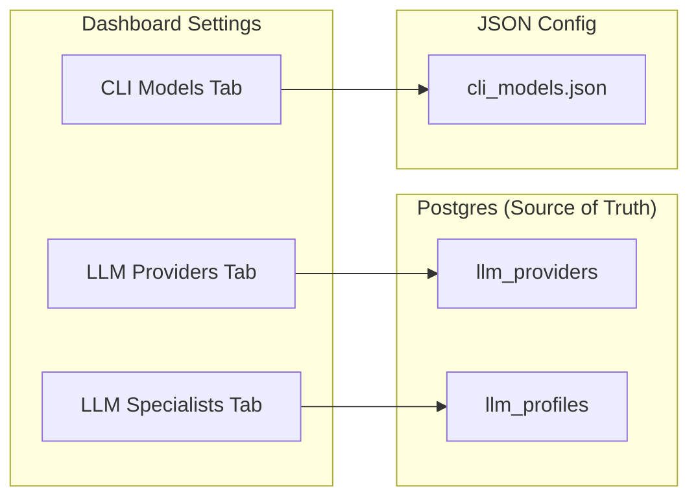
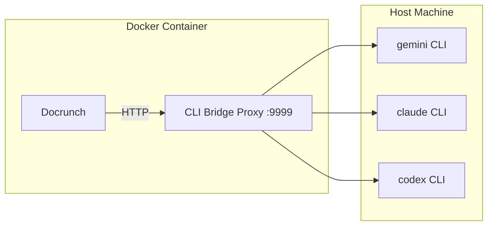

# LLM Specialists & Providers

> **Source:** This architecture is based on the proven Ettutu V2 implementation. All settings stored in Postgres except CLI models (JSON file, editable via UI).

---

## Settings Architecture



---

## Database Tables

### `llm_providers` - Provider Configurations

```sql
CREATE TABLE llm_providers (
    id UUID PRIMARY KEY,
    name VARCHAR(100) NOT NULL,           -- "CLI Gemini", "OpenAI", "Ollama"
    provider_type VARCHAR(50) NOT NULL,   -- cli_bridge, openai, anthropic, xai, google, ollama
    is_enabled BOOLEAN DEFAULT true,
    config JSONB,                         -- API keys (encrypted), base URLs, cli_type
    created_at TIMESTAMP,
    updated_at TIMESTAMP
);
```

### `llm_profiles` - Specialist Profiles

```sql
CREATE TABLE llm_profiles (
    id UUID PRIMARY KEY,
    role VARCHAR(50) UNIQUE NOT NULL,     -- librarian, security, qa, uiux, chat, analyzer
    display_name VARCHAR(100),            -- "Librarian LLM", "Security LLM"
    description TEXT,
    provider_id UUID REFERENCES llm_providers(id),
    model VARCHAR(100),                   -- "gemini-2.5-flash", "sonnet"
    temperature DECIMAL(3,2) DEFAULT 0.7,
    system_prompt TEXT,                   -- Optional override
    created_at TIMESTAMP,
    updated_at TIMESTAMP
);
```

---

## CLI Models Configuration

Stored in `.docrunch/cli_models.json`:

```json
{
  "gemini": {
    "description": "Google Gemini CLI models",
    "models": [
      {
        "id": "gemini-2.5-flash",
        "name": "Gemini 2.5 Flash",
        "description": "High performance, low latency"
      },
      {
        "id": "gemini-2.5-flash-lite",
        "name": "Gemini 2.5 Flash Lite",
        "description": "Fastest, cost efficient"
      },
      {
        "id": "gemini-3-pro-preview",
        "name": "Gemini 3 Pro",
        "description": "Advanced reasoning"
      }
    ]
  },
  "claude": {
    "description": "Anthropic Claude CLI models",
    "models": [
      {
        "id": "sonnet",
        "name": "Claude 3.5 Sonnet",
        "description": "Balanced performance and speed"
      },
      {
        "id": "opus",
        "name": "Claude 3 Opus",
        "description": "Most powerful model"
      },
      {
        "id": "haiku",
        "name": "Claude 3.5 Haiku",
        "description": "Fastest, most compact model"
      }
    ]
  },
  "codex": {
    "description": "OpenAI Codex CLI models",
    "models": [
      {
        "id": "gpt-5.2-codex",
        "name": "GPT-5.2 Codex",
        "description": "Latest frontier agentic coding model"
      },
      {
        "id": "o4-mini",
        "name": "O4 Mini",
        "description": "Optimized for codex, cheaper, faster"
      }
    ]
  }
}
```

---

## CLI Bridge Proxy (Docker Mode)

See [CLI Bridge](./CLI_bridge.md) for provider and proxy behavior.

When Docrunch runs in Docker/Cloud, it cannot directly access CLI tools on the host machine. The **CLI Bridge Proxy** creates a tunnel:



### Proxy Server

Run on host machine (outside Docker):

```bash
python scripts/cli_proxy.py --port 9999
# Or with API key protection:
python scripts/cli_proxy.py --port 9999 --api-key mysecretkey
```

### Provider Configuration

In Docker, configure CLI Bridge providers with `proxy_url`:

```json
{
  "name": "CLI Gemini",
  "provider_type": "cli_bridge",
  "config": {
    "cli_type": "gemini",
    "proxy_url": "http://host.docker.internal:9999",
    "proxy_api_key": "mysecretkey"
  }
}
```

### Environment Variables

| Variable            | Description                                    |
| ------------------- | ---------------------------------------------- |
| `CLI_PROXY_URL`     | Default proxy URL for all CLI Bridge providers |
| `CLI_PROXY_API_KEY` | API key for proxy authentication               |

### Deployment Modes

| Mode                  | CLI Bridge Config                                   |
| --------------------- | --------------------------------------------------- |
| **Local development** | Direct subprocess (no proxy needed)                 |
| **Docker Compose**    | `proxy_url: http://host.docker.internal:9999`       |
| **Cloud/VPS**         | Run proxy on same host or use API providers instead |

---

## Dashboard UI Design

### Tab 1: LLM Providers

**Add Provider Modal:**

- Provider Type dropdown: OpenAI, Anthropic, xAI, Google AI, Ollama, CLI Bridge
- Name field (auto-populated based on type)
- API Key field (for API providers)
- Base URL field (for Ollama/custom endpoints)
- Enabled checkbox
- Add Provider / Cancel buttons

**Provider Cards:**

- Toggle switch (enabled/disabled)
- Provider name + type badge
- Masked API Key display
- Test button (health check)
- Edit / Delete buttons

| Provider Type | Config Fields                      |
| ------------- | ---------------------------------- |
| `openai`      | api_key, base_url                  |
| `anthropic`   | api_key                            |
| `xai`         | api_key, base_url                  |
| `google`      | api_key                            |
| `ollama`      | base_url                           |
| `cli_bridge`  | cli_type, executable_path, proxy_url, proxy_api_key, timeout |

### Tab 2: LLM Specialists (Workforce)

**Specialist Cards:**

- Icon + Role name + Description
- Provider dropdown
- Model name input (with autocomplete from provider's models)
- Temperature slider (0.0 - 1.0)
- Test button
- Save button

| Role          | Description                                    |
| ------------- | ---------------------------------------------- |
| **Librarian** | Documentation, RAG indexing, pattern detection |
| **Security**  | Threat modeling, secrets detection             |
| **QA**        | Test generation, coverage analysis             |
| **UI/UX**     | Dashboard design, accessibility                |
| **Chat**      | User conversations, RAG-powered Q&A            |
| **Analyzer**  | Code analysis, summarization                   |

> [!NOTE] > **Provider Flexibility:** All Layer 1 specialists can use any provider type including CLI Bridge. CLI Bridge works well for complex analysis tasks.
>
> **Chat → Layer 2 Routing:** The Chat specialist can escalate implementation questions to Layer 2 coding agents (Manager → Sub-agents) when users need code changes rather than just documentation queries. |

### Tab 3: CLI Models

Tabbed view by CLI type (Gemini / Claude / Codex):

- Model list with ID, display name, description
- Add Model button
- Delete button per model
- Note: "Changes saved to `.docrunch/cli_models.json`"

---

## Reference Screenshots

```carousel

<!-- slide -->

<!-- slide -->

<!-- slide -->

<!-- slide -->

```

---

## API Endpoints

### Providers CRUD

- `GET /api/llm/providers` - List all providers
- `POST /api/llm/providers` - Create provider
- `PATCH /api/llm/providers/{id}` - Update provider
- `DELETE /api/llm/providers/{id}` - Delete provider
- `POST /api/llm/providers/{id}/test` - Test provider health

### Profiles CRUD

- `GET /api/llm/profiles` - List all profiles
- `PATCH /api/llm/profiles/{role}` - Update profile assignment
- `POST /api/llm/profiles/{role}/test` - Test profile

### CLI Models (JSON file)

- `GET /api/llm/cli-models` - List all CLI model sets
- `GET /api/llm/cli-models/{cli_type}` - Get models for a CLI type
- `PUT /api/llm/cli-models/{cli_type}` - Replace models for a CLI type
- `POST /api/llm/cli-models/{cli_type}/models` - Add model
- `DELETE /api/llm/cli-models/{cli_type}/models/{model_id}` - Delete model
