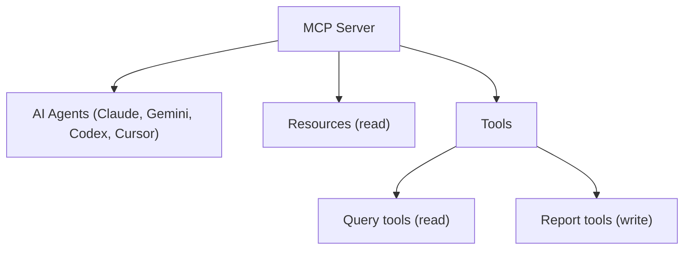
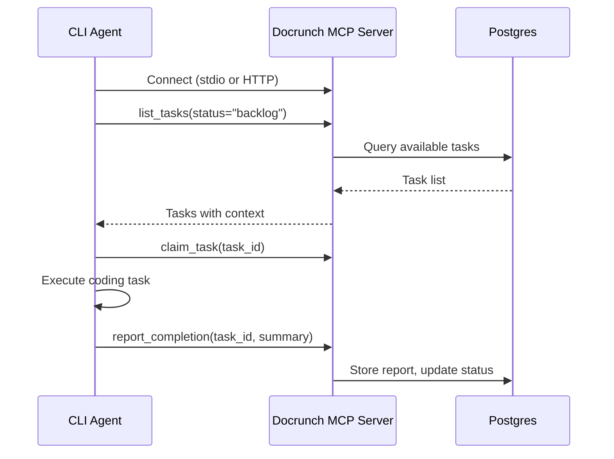

# MCP Server

Bidirectional Model Context Protocol server enabling AI agents to query documentation AND report back their work.

## Overview

**MVP scope:** Bidirectional MCP with resources, query tools, and report tools. Report tools write to Postgres and trigger storage sync to Markdown/LightRAG.

MCP over stdio is enabled with `docrunch serve --stdio`. MCP over HTTP is optional
via `server.mcp.transport: http` in config.



## Components

```
docrunch/mcp/
- server.py        # MCP server implementation
- resources.py     # Resource handlers
- tools_query.py   # Query tools (read)
- tools_report.py  # Report tools (write)
```

---

## Resources

Resources provide read-only context that AI agents can access.

### Resource URIs

| URI                       | Description                   |
| ------------------------- | ----------------------------- |
| `docs://architecture`     | System architecture overview  |
| `docs://modules`          | List of all modules           |
| `docs://modules/{name}`   | Specific module documentation |
| `docs://functions/{path}` | Function documentation        |
| `docs://schemas`          | All database schemas          |
| `docs://schemas/{name}`   | Specific schema               |
| `docs://patterns`         | Established code patterns     |
| `docs://tasks/available`  | Tasks ready to claim          |
| `docs://tasks/active`     | Currently in-progress tasks   |
| `docs://tasks/{id}`       | Specific task details         |
| `docs://decisions`        | Architecture decision records |
| `docs://recent-changes`   | Recent file modifications     |

### Resource Implementation

```python
# resources.py
from mcp.server import Server
from mcp.types import Resource

@server.list_resources()
async def list_resources() -> list[Resource]:
    return [
        Resource(
            uri="docs://architecture",
            name="Architecture",
            description="System architecture overview",
            mimeType="text/markdown"
        ),
        # ... more resources
    ]

@server.read_resource()
async def read_resource(uri: str) -> str:
    if uri == "docs://architecture":
        return storage.get_architecture_doc()
    elif uri.startswith("docs://modules/"):
        name = uri.split("/")[-1]
        return storage.get_module_doc(name)
    # ... handle other URIs
```

---

## Query Tools (Read)

Tools that allow AI agents to search and retrieve information.

### search_docs

Semantic search across documentation and reports.

```python
@server.call_tool()
async def search_docs(
    query: str,
    limit: int = 10,
    scope: str = "docs"  # docs | reports | all
) -> list[SearchResult]:
    """
    Search documentation and reports semantically.

    Args:
        query: Natural language search query
        limit: Maximum results to return
        scope: Which corpus to search (docs, reports, or all). Default: docs

    Returns:
        List of relevant documentation snippets
    """
    return await query_engine.search(query, limit=limit, scope=scope)
```

### get_component

Get detailed information about a code component.

```python
@server.call_tool()
async def get_component(name: str) -> ComponentInfo:
    """
    Get component details including relationships.

    Args:
        name: Component name (module, class, or function)

    Returns:
        Component info with dependencies, exports, usage
    """
```

### get_relations

Get relationships for a file or component.

```python
@server.call_tool()
async def get_relations(path: str) -> RelationshipInfo:
    """
    Get imports, exports, and usage relationships.

    Args:
        path: File path or component name

    Returns:
        Relationship graph for the component
    """
```

### get_task

Get task details with full context.

```python
@server.call_tool()
async def get_task(task_id: str) -> TaskInfo:
    """
    Get task with context, guardrails, and dependencies.

    Args:
        task_id: Task identifier

    Returns:
        Complete task information for agent to execute
    """
```

### get_available_tasks

List tasks available for claiming.

```python
@server.call_tool()
async def get_available_tasks(agent_type: str = None) -> list[TaskSummary]:
    """
    Get tasks that can be claimed.

    Args:
        agent_type: Optional filter by agent (gemini, claude, etc.)

    Returns:
        List of available tasks with brief info
    """
```

---

## Report Tools (Write)

Report tools are first-class and keep the knowledge base current.

Tools that allow AI agents to report their work back.

Completion reports publish Markdown task reports by default. Explicit publish
commands are planned for a later phase.

### claim_task

Claim an available task for execution.

```python
@server.call_tool()
async def claim_task(task_id: str, agent_id: str) -> ClaimResult:
    """
    Claim a task for execution.

    Args:
        task_id: Task to claim
        agent_id: Identifier for the claiming agent

    Returns:
        Task context with guardrails and dependencies
    """
```

### update_progress

Report progress on a task.

```python
@server.call_tool()
async def update_progress(
    task_id: str,
    percentage: int,
    status: str
) -> bool:
    """
    Update task progress.

    Args:
        task_id: Task being worked on
        percentage: Completion percentage (0-100)
        status: Current status description
    """
```

### submit_completion

Submit completed task with report.

```python
@server.call_tool()
async def submit_completion(
    task_id: str,
    summary: str,
    changes: list[str],
    tests_passed: bool = True,
    notes: str = None
) -> CompletionResult:
    """
    Submit task completion report.

    Args:
        task_id: Completed task ID
        summary: What was accomplished
        changes: List of files changed
        tests_passed: Whether tests pass
        notes: Additional notes

    Returns:
        Completion status and next steps
    """
```

### log_finding

Log a discovery or issue found during work.

```python
@server.call_tool()
async def log_finding(
    task_id: str,
    type: str,  # bug, improvement, question, blocker
    description: str,
    files: list[str] = None
) -> str:
    """
    Log a finding during task execution.

    Args:
        task_id: Related task
        type: Type of finding
        description: What was found
        files: Related files

    Returns:
        Finding ID
    """
```

### record_decision

Record an architecture decision.

```python
@server.call_tool()
async def record_decision(
    title: str,
    context: str,
    decision: str,
    rationale: str
) -> str:
    """
    Record an architecture decision (ADR).

    Args:
        title: Decision title
        context: Why this decision was needed
        decision: What was decided
        rationale: Why this choice was made

    Returns:
        Decision ID
    """
```

### report_blocker

Report a blocking issue.

```python
@server.call_tool()
async def report_blocker(
    task_id: str,
    description: str,
    needs: str  # What's needed to unblock
) -> str:
    """
    Report a blocking issue that prevents progress.

    Args:
        task_id: Blocked task
        description: What's blocking
        needs: What's needed to unblock
    """
```

---

## Server Implementation

```python
# server.py
from mcp.server import Server
from mcp.server.stdio import stdio_server

app = Server("docrunch")

# Register resources and tools
from .resources import register_resources
from .tools_query import register_query_tools
from .tools_report import register_report_tools

register_resources(app)
register_query_tools(app)
register_report_tools(app)

async def main():
    async with stdio_server() as (read, write):
        await app.run(read, write)
```

## Configuration

```yaml
# .docrunch/config.yaml
server:
  mcp:
    enabled: true
    transport: stdio
    host: localhost
    port: 3334 # used only for http transport

    # Rate limiting
    rate_limit:
      queries_per_minute: 60
      writes_per_minute: 30
```

Note: `host` and `port` apply only when `transport` is `http`.

## CLI Agent Configuration

Docrunch's MCP server can be connected to various coding agents and editors.

### Task Access Flow via MCP



### Agent Configuration Files

#### Claude CLI

Config: `~/.claude/config.json`

```json
{
  "mcpServers": {
    "docrunch": {
      "command": "docrunch",
      "args": ["serve", "--stdio"]
    }
  }
}
```

#### Gemini CLI

Config: `~/.gemini/settings.json`

```json
{
  "mcpServers": {
    "docrunch": {
      "command": "docrunch",
      "args": ["serve", "--stdio"]
    }
  }
}
```

#### Codex CLI

Config: `~/.codex/config.json`

```json
{
  "mcpServers": {
    "docrunch": {
      "command": "docrunch",
      "args": ["serve", "--stdio"]
    }
  }
}
```

### Editor Integration

#### VS Code

Extensions with MCP support:

- [Claude for VS Code](https://marketplace.visualstudio.com/items?itemName=anthropic.claude-for-vs-code)
- [Continue.dev](https://continue.dev)

Configure via extension settings to connect to Docrunch's MCP server.

#### Antigravity

Built-in MCP support. Add server in settings:

- Command: `docrunch`
- Args: `serve --stdio`

### HTTP Transport (Alternative)

For tools without stdio support, use HTTP transport:

```bash
# Start MCP server with HTTP
docrunch serve --http --port 3334
```

Configure agents to connect via HTTP:

```json
{
  "mcpServers": {
    "docrunch": {
      "url": "http://localhost:3334"
    }
  }
}
```

### Integration Summary

| Tool         | Transport | Config Location           |
| ------------ | --------- | ------------------------- |
| Claude CLI   | stdio     | `~/.claude/config.json`   |
| Gemini CLI   | stdio     | `~/.gemini/settings.json` |
| Codex CLI    | stdio     | `~/.codex/config.json`    |
| VS Code      | stdio     | Extension settings        |
| Antigravity  | stdio     | Built-in settings         |
| Custom tools | HTTP      | API to `localhost:3334`   |

```

```
