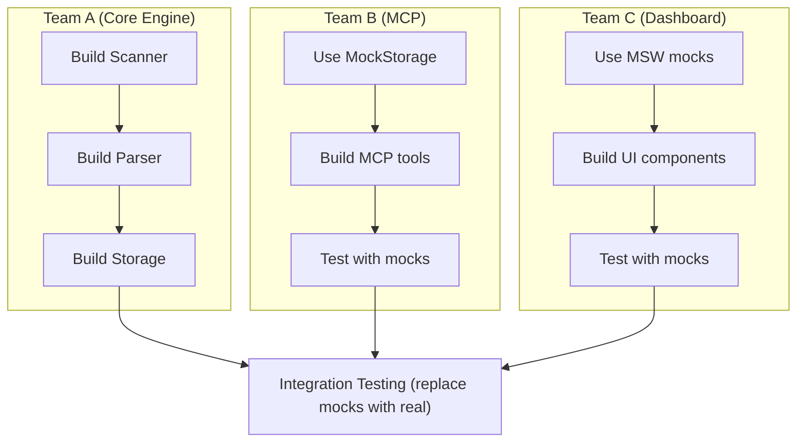

# Mocking Strategy for Parallel Development

## Purpose

Enable parallel development where teams working on different components (MCP, Core Engine, Dashboard) don't block each other.

---

## Mock Interfaces

### For MCP Development (mock Core Engine)

When building MCP tools before the Core Engine is ready:

```python
# docrunch/mcp/mocks.py

class MockStorageHub:
    """Mock storage for MCP development."""

    async def search(self, query: str) -> list[SearchResult]:
        """Return fake search results."""
        return [
            SearchResult(
                id="mock-1",
                title="auth/login.py",
                content="Handles JWT authentication...",
                score=0.95,
            ),
            SearchResult(
                id="mock-2",
                title="auth/middleware.py",
                content="Auth middleware for routes...",
                score=0.87,
            ),
        ]

    async def get_module(self, name: str) -> Module:
        """Return mock module data."""
        return Module(
            name=name,
            path=f"src/{name}.py",
            functions=["func_a", "func_b"],
            classes=["ClassA"],
        )

# Usage in MCP server during development
if settings.use_mocks:
    storage = MockStorageHub()
else:
    storage = StorageHub()
```

### For Dashboard Development (mock REST API)

When building Dashboard before backend is ready:

```typescript
// web/src/mocks/api.ts

export const mockTasks: Task[] = [
  {
    id: "task-001",
    title: "Implement auth",
    status: "working",
    assignee: "claude",
    priority: "high",
  },
  {
    id: "task-002",
    title: "Add user profile",
    status: "todo",
    assignee: null,
    priority: "medium",
  },
];

export const mockModules: Module[] = [
  {
    name: "auth",
    path: "src/auth/",
    functions: 12,
    classes: 3,
  },
];

// MSW handler
export const handlers = [
  http.get("/api/tasks", () => {
    return HttpResponse.json(mockTasks);
  }),
  http.get("/api/modules", () => {
    return HttpResponse.json(mockModules);
  }),
];
```

### For Core Engine Development (mock LLM/LightRAG)

When building Scanner/Parser before LLM is configured:

```python
# docrunch/core/mocks.py

class MockLLMProvider:
    """Mock LLM for development without API keys."""

    async def summarize(self, code: str) -> str:
        return f"[Mock summary for {len(code)} chars of code]"

    async def generate_docs(self, component: Component) -> str:
        return f"# {component.name}\n\nMock documentation."

class MockLightRAG:
    """In-memory mock for LightRAG."""

    def __init__(self):
        self._documents = {}

    async def index(self, doc: Document):
        self._documents[doc.id] = doc

    async def search(self, query: str) -> list[Result]:
        # Simple keyword matching for mocks
        matches = [
            d for d in self._documents.values()
            if query.lower() in d.content.lower()
        ]
        return matches[:10]
```

---

## Configuration

Enable mocks via config or environment:

```yaml
# .docrunch/config.yaml
dev:
  use_mocks: true
  mock_components:
    - llm
    - lightrag
    # - storage  # Uncomment to mock all storage
```

Or via environment:

```bash
DOCRUNCH_USE_MOCKS=true docrunch serve
```

---

## When to Use Mocks

| Scenario                        | Mock            |
| ------------------------------- | --------------- |
| Building MCP before Core Engine | MockStorageHub  |
| Building Dashboard before API   | MSW handlers    |
| Running without LLM API keys    | MockLLMProvider |
| Testing without vector DB       | MockLightRAG    |
| CI/CD pipeline tests            | All mocks       |

---

## Mock Data Location

```
docrunch/
- mcp/mocks.py           # MCP development mocks
- core/mocks.py          # Core engine mocks
- tests/fixtures/        # Shared test fixtures

web/
- src/mocks/
  - handlers.ts        # MSW handlers
  - data.ts            # Mock data
```

---

## Parallel Development Flow


