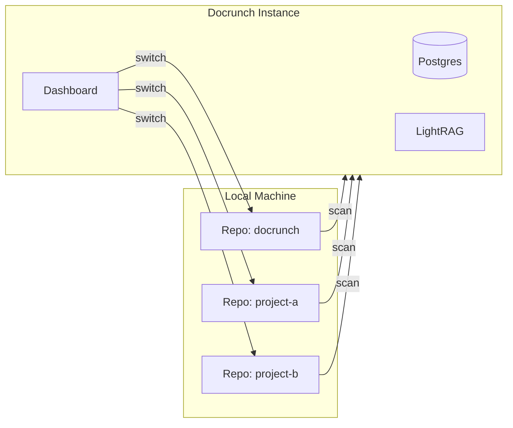

# Multi-Repository Management

Manage multiple repositories from a single Docrunch instance with unified progress tracking.

## Overview

Docrunch can track multiple repositories simultaneously:



---

## Data Model

### Repository Table

```sql
CREATE TABLE repositories (
    id UUID PRIMARY KEY,
    name VARCHAR(255) NOT NULL,
    path TEXT NOT NULL,              -- Local path: D:\Workspaces\project-a
    remote_url TEXT,                 -- GitHub: https://github.com/user/repo
    default_branch VARCHAR(100),
    is_active BOOLEAN DEFAULT true,
    last_scan_at TIMESTAMP,
    last_scan_commit VARCHAR(40),
    created_at TIMESTAMP,
    updated_at TIMESTAMP
);
```

### Foreign Key Updates

All existing tables gain a `repository_id` column:

```sql
ALTER TABLE files ADD COLUMN repository_id UUID REFERENCES repositories(id);
ALTER TABLE tasks ADD COLUMN repository_id UUID REFERENCES repositories(id);
ALTER TABLE findings ADD COLUMN repository_id UUID REFERENCES repositories(id);
ALTER TABLE decisions ADD COLUMN repository_id UUID REFERENCES repositories(id);
```

---

## Configuration

```yaml
# .docrunch/config.yaml
repositories:
  - name: docrunch
    path: D:\Workspaces\Docrunch
    remote: https://github.com/Tecet/docrunch
    default_branch: main
    auto_scan: true

  - name: project-a
    path: D:\Workspaces\ProjectA
    remote: https://github.com/Tecet/project-a
    default_branch: main
    auto_scan: false

  - name: project-b
    path: D:\Workspaces\ProjectB
    # No remote - local only
```

---

## Dashboard UI

### Repository Selector

Dropdown in header to switch active repository:

- Shows repo name + last scan time
- Quick switch with keyboard shortcut
- Badge showing pending tasks per repo

### Repository Management Page

| Action            | Description                      |
| ----------------- | -------------------------------- |
| Add Repository    | Select folder or clone from URL  |
| Remove Repository | Removes from tracking (not disk) |
| Scan Now          | Trigger immediate scan           |
| View Stats        | Files, tasks, coverage per repo  |

---

## CLI Commands

```bash
# List all repositories
docrunch repo list

# Add a repository
docrunch repo add --path D:\Workspaces\NewProject
docrunch repo add --clone https://github.com/user/repo

# Remove a repository
docrunch repo remove project-a

# Switch active repository
docrunch repo use project-a

# Scan specific repository
docrunch scan --repo project-a

# Scan all repositories
docrunch scan --all
```

---

## MCP Context

Agents receive repository context:

```json
{
  "repository": {
    "name": "docrunch",
    "path": "D:\\Workspaces\\Docrunch",
    "remote": "https://github.com/Tecet/docrunch",
    "branch": "main"
  }
}
```

Query tools scoped to current repository by default:

- `search_docs` → searches active repo
- `get_tasks` → returns tasks for active repo

Cross-repo search with `--all-repos` flag.

---

## Implementation Phase

**Phase 1** (MVP Core Feature): Multi-repository support from day one

### Tasks

| Task     | Description                                 |
| -------- | ------------------------------------------- |
| TASK-005 | Add `repositories` table to Postgres schema |
| TASK-006 | Add `repository_id` FK to all tables        |
| TASK-018 | Repository selector in dashboard header     |
| TASK-044 | Full multi-repo CLI and UI                  |

### Migration Path (for future single-repo users)

1. On first run, create default repository from current directory
2. Allow adding more repos via CLI or dashboard
