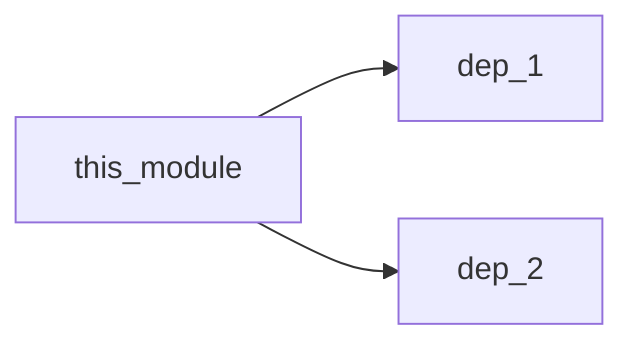
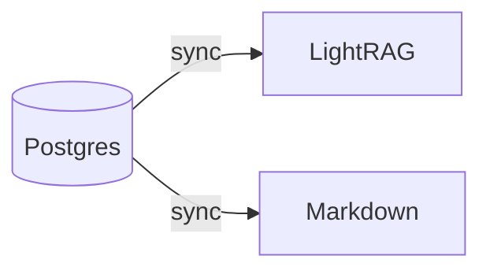

# Storage Layer

The Storage Layer persists documentation, metadata, and vector embeddings for semantic search.

## Components

See [Data Synchronization](./data_sync.md) for how Postgres, LightRAG, and Markdown stay in sync.
See [Postgres](./postgres.md) for schema details and [Background Jobs](./jobs.md) for Redis + Temporal workers.

```
docrunch/storage/
- lightrag.py   # Vector storage + knowledge graph
- postgres.py   # Metadata and task storage
- markdown.py   # Markdown file output
```

---

## LightRAG (`lightrag.py`)

Vector storage with knowledge graph for semantic search and relationship tracking.

Reference code snapshot: `.dev/reference/LightRAG-main`.

### Why LightRAG?

-   **Knowledge Graph** - Built-in entity relationships (like Obsidian graph view)
-   **Semantic Search** - Find relevant docs by meaning, not keywords
-   **RAG Pipeline** - Complete retrieval-augmented generation

### Data Stored

| Type           | Content                       |
| -------------- | ----------------------------- |
| Code Summaries | Function/class descriptions   |
| Documentation  | Generated markdown content    |
| Patterns       | Code pattern descriptions     |
| Decisions      | Architecture decision records |
| Relationships  | Graph edges between entities  |

### Key Functions

```python
class LightRAGStorage:
    async def index(self, document: Document) -> str:
        """Index a document with embeddings."""

    async def search(self, query: str, limit: int = 10) -> list[Result]:
        """Semantic search across all documents."""

    async def get_related(self, entity_id: str) -> list[Entity]:
        """Get related entities from knowledge graph."""

    async def update(self, doc_id: str, content: str):
        """Update existing document."""

    def export_graph(self) -> GraphData:
        """Export knowledge graph for visualization."""
```

### Document Schema

```python
@dataclass
class Document:
    id: str
    type: str  # function, class, module, pattern, decision
    title: str
    content: str
    metadata: dict
    relationships: list[Relationship]
```

### Configuration

```yaml
# .docrunch/config.yaml
storage:
    vector_db: lightrag
    lightrag:
        base_url: http://localhost:9621
        embedding_model: text-embedding-3-small
        chunk_size: 1000
        chunk_overlap: 200
```

---

## Postgres (`postgres.py`)

Primary metadata storage for file index, tasks, reports, and quick lookups.

### Tables

```sql
-- File index
CREATE TABLE files (
    id TEXT PRIMARY KEY,
    path TEXT UNIQUE,
    language TEXT,
    size INTEGER,
    modified_at TIMESTAMP,
    content_hash TEXT,
    last_scanned TIMESTAMP
);


-- LLM providers
CREATE TABLE llm_providers (
    id TEXT PRIMARY KEY,
    name TEXT, -- "CLI Gemini", "OpenAI", "Ollama"
    provider_type TEXT, -- openai | anthropic | xai | google | ollama | cli_bridge
    is_enabled BOOLEAN,
    config JSON, -- api_key, base_url, cli_type, proxy_url, timeout
    created_at TIMESTAMP,
    updated_at TIMESTAMP
);

-- LLM specialist profiles
CREATE TABLE llm_profiles (
    id TEXT PRIMARY KEY,
    role TEXT, -- manager | librarian | qa | security | ui_ux | chat | analyzer
    display_name TEXT,
    description TEXT,
    provider_id TEXT,
    model TEXT,
    temperature REAL,
    system_prompt TEXT,
    max_tokens INTEGER,
    enabled BOOLEAN,
    created_at TIMESTAMP,
    updated_at TIMESTAMP,
    FOREIGN KEY (provider_id) REFERENCES llm_providers(id)
);

-- Chat sessions
CREATE TABLE chat_sessions (
    id TEXT PRIMARY KEY,
    title TEXT,
    created_at TIMESTAMP,
    updated_at TIMESTAMP
);

-- Chat messages
CREATE TABLE chat_messages (
    id TEXT PRIMARY KEY,
    session_id TEXT,
    role TEXT, -- user | assistant | system
    content TEXT,
    citations JSON,
    created_at TIMESTAMP,
    FOREIGN KEY (session_id) REFERENCES chat_sessions(id)
);

-- Relationships
CREATE TABLE relationships (
    id TEXT PRIMARY KEY,
    source_file TEXT,
    target_file TEXT,
    type TEXT,  -- imports, calls, inherits
    metadata JSON,
    FOREIGN KEY (source_file) REFERENCES files(id),
    FOREIGN KEY (target_file) REFERENCES files(id)
);

-- Tasks
CREATE TABLE tasks (
    id TEXT PRIMARY KEY,
    type TEXT,
    title TEXT,
    description TEXT,
    status TEXT,
    priority TEXT,
    assigned_to TEXT,
    depends_on JSON,
    guardrails JSON,
    context JSON,
    created_at TIMESTAMP,
    updated_at TIMESTAMP,
    completed_at TIMESTAMP
);

-- Task history
CREATE TABLE task_history (
    id TEXT PRIMARY KEY,
    task_id TEXT,
    action TEXT,
    agent TEXT,
    details JSON,
    timestamp TIMESTAMP,
    FOREIGN KEY (task_id) REFERENCES tasks(id)
);

-- Findings
CREATE TABLE findings (
    id TEXT PRIMARY KEY,
    task_id TEXT,
    type TEXT,
    description TEXT,
    files JSON,
    created_by TEXT,
    created_at TIMESTAMP,
    FOREIGN KEY (task_id) REFERENCES tasks(id)
);

-- Decisions
CREATE TABLE decisions (
    id TEXT PRIMARY KEY,
    title TEXT,
    context TEXT,
    decision TEXT,
    rationale TEXT,
    created_at TIMESTAMP,
    created_by TEXT
);

-- Completion reports
CREATE TABLE completion_reports (
    id TEXT PRIMARY KEY,
    task_id TEXT,
    summary TEXT,
    changes JSON,
    tests_passed BOOLEAN,
    notes TEXT,
    created_at TIMESTAMP,
    created_by TEXT,
    FOREIGN KEY (task_id) REFERENCES tasks(id)
);

-- Blockers
CREATE TABLE blockers (
    id TEXT PRIMARY KEY,
    task_id TEXT,
    description TEXT,
    needs TEXT,
    status TEXT, -- open | resolved
    created_at TIMESTAMP,
    resolved_at TIMESTAMP,
    created_by TEXT,
    FOREIGN KEY (task_id) REFERENCES tasks(id)
);
```

CLI Bridge model lists are stored in `.docrunch/cli_models.json` and surfaced via the CLI models API.

### Report Storage Contract

Report tools write to Postgres as follows:

-   claim_task and update_progress -> task_history (action + details)
-   submit_completion -> completion_reports and task_history
-   log_finding -> findings
-   record_decision -> decisions
-   report_blocker -> blockers and task_history

Required report fields are validated at the API boundary (see `docs/interfaces.md`).
Markdown task reports are generated only after completion or explicit publish.

### Key Functions

```python
class PostgresStorage:
    def get_file(self, path: str) -> FileRecord | None:
        """Get file metadata by path."""

    def get_relationships(self, file_id: str) -> list[Relationship]:
        """Get all relationships for a file."""

    def create_task(self, task: Task) -> str:
        """Create new task, return ID."""

    def update_task_status(self, task_id: str, status: str):
        """Update task status."""

    def get_tasks_by_status(self, status: str) -> list[Task]:
        """Get tasks in a specific status."""

    def log_task_action(self, task_id: str, action: str, details: dict):
        """Log task history entry."""
```

---

## Markdown Output (`markdown.py`)

Generates human-readable markdown documentation in the repository.

> [!NOTE] > **Current Behavior (MVP):** Task reports are automatically generated when completion reports are submitted.
>
> **Planned (Post-MVP):** Explicit `docrunch task publish <id>` command to control when task reports are published to Markdown.

Progress updates remain in Postgres to preserve real-time state without rewriting Markdown on every update.

### Output Structure

```
docrunch-docs/
- index.md                  # Main index with navigation
- architecture.md           # System overview diagram
- modules/
  - index.md                # Module list
  - {module_name}.md        # Per-module docs
- functions/
  - {function_name}.md      # Function reference
- schemas/
  - {schema_name}.md        # Database schemas
- patterns/
  - {pattern_name}.md       # Code patterns
- decisions/
  - {adr-001}.md            # Architecture decisions
- tasks/
  - {task_id}.md            # Completed task reports
```

### Templates

#### Module Template

````markdown
# {module_name}

## Overview

{ai_generated_summary}

## Dependencies


````

## Exports

| Name | Type | Description |
| ---- | ---- | ----------- |
| ...  | ...  | ...         |

## Usage Examples

{code_examples}

````

#### Function Template
```markdown
# {function_name}

**File:** `{file_path}`
**Line:** {line_number}

## Signature
```{language}
{signature}
````

## Description

{ai_generated_description}

## Parameters

| Name | Type | Description |
| ---- | ---- | ----------- |
| ...  | ...  | ...         |

## Returns

{return_description}

## Used By

-   [{caller_name}]({link})

````

### Key Functions

```python
class MarkdownOutput:
    def generate_index(self, tree: FileTree) -> str:
        """Generate main index page."""

    def generate_module_doc(self, module: Module) -> str:
        """Generate module documentation."""

    def generate_function_doc(self, func: Function) -> str:
        """Generate function documentation."""

    def write_docs(self, output_dir: Path):
        """Write all documentation to disk."""
````

---

## Storage Sync Architecture

### Source of Truth

**Postgres is the source of truth** for all structured data. LightRAG and Markdown are derived stores.

Agent reports (findings, decisions, completion reports) are stored in Postgres and emit sync events so Markdown and LightRAG stay current. Markdown task reports are generated on completion or explicit publish.



### Data Flow

1. SCAN: Files -> Parser -> Postgres (write) -> LightRAG/Markdown (derive)
2. UPDATE (file change detected): New content -> Postgres (update) -> trigger sync to derived stores
3. QUERY: Query -> LightRAG (if available) -> fallback to Postgres text search
4. REBUILD (recover from corruption): Postgres -> re-index LightRAG -> re-generate Markdown

### Report Flow

1. REPORT (agent update): Report tool -> Postgres (write) -> trigger sync to derived stores
2. PUBLISH (task report): Completion report -> Markdown tasks/{task_id}.md (on completion or explicit publish)

### Sync Behavior

```python
class StorageHub:
    """Coordinates writes and emits sync events."""

    async def on_file_indexed(self, file: FileRecord):
        """Persist to Postgres and enqueue projections."""
        async with self.postgres.transaction():
            await self.postgres.upsert_file(file)
            await self.postgres.enqueue_sync_event(
                entity_type="file",
                entity_id=file.id,
                content_hash=file.content_hash,
                action="upsert",
            )
```

### Failure Handling

| Scenario               | Behavior                                          |
| ---------------------- | ------------------------------------------------- |
| LightRAG unavailable   | Continue with Postgres only; queue for retry      |
| Markdown write fails   | Log error; queue for retry                        |
| Postgres fails         | **STOP** - Cannot proceed without source of truth |
| Sync backlog too large | Trigger full rebuild                              |

Failures are recorded in `storage_sync` and retried by the sync worker (see `docs/components/data_sync.md`).

### Sync Worker (Derived Stores)

Sync workers can run in-process for local dev or consume jobs from Redis in hosted deployments.

```python
class SyncWorker:
    async def process_event(self, event: SyncEvent):
        if event.action == "delete":
            await self.delete_projection(event)
            return

        if self.is_already_synced(event):
            return

        await self.update_projection(event)
```

### Configuration

```yaml
storage:
    sync:
        enabled: true
        targets: [lightrag, markdown]
        max_retries: 5
        backoff_seconds: 2
        max_backoff_seconds: 120
        report_sla_seconds: 60
        scan_sla_seconds: 300
        poll_interval_seconds: 5
        prioritize: reports
```
