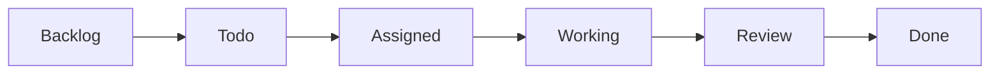
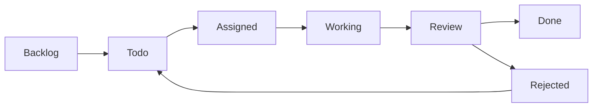

# Task System

The Task System provides Kanban-style task orchestration for AI coding agents.

## Overview



## Components

```
docrunch/core/
- task_manager.py     # Task lifecycle management
- ...

docrunch/models/
- task.py             # Task data model
- pipeline.py         # Pipeline stage definitions
```

---

## Task Model

```python
@dataclass
class Task:
    # Identity
    id: str
    type: TaskType           # bug_fix, feature, refactor, docs, test, security
    title: str
    description: str

    # Assignment
    assigned_to: str | None  # gemini, claude, codex, or None (auto)
    priority: Priority       # low, medium, high, critical

    # Dependencies
    depends_on: list[str]    # Task IDs this depends on
    blocks: list[str]        # Task IDs this blocks

    # Context (auto-populated from LightRAG)
    context: TaskContext

    # Guardrails
    guardrails: list[str]
    acceptance_criteria: list[str]

    # Review
    review_mode: ReviewMode  # auto, human, manager

    # Status
    status: TaskStatus
    progress: int            # 0-100

    # Timestamps
    created_at: datetime
    started_at: datetime | None
    completed_at: datetime | None

    # Completion
    completion_report: CompletionReport | None

@dataclass
class TaskContext:
    relevant_files: list[str]
    patterns_to_follow: list[str]
    schemas: list[str]
    related_docs: list[str]

@dataclass
class CompletionReport:
    summary: str
    changes: list[str]
    findings: list[Finding]
    decisions: list[Decision]
    tests_passed: bool
    notes: str | None
    reported_by: str
    reported_at: datetime
```

---

## Task Types (Templates)

| Type       | Description           | Default Review           |
| ---------- | --------------------- | ------------------------ |
| `bug_fix`  | Fix reported issues   | Auto (low), Human (high) |
| `feature`  | New functionality     | Human                    |
| `refactor` | Code improvement      | Manager                  |
| `docs`     | Documentation updates | Auto                     |
| `test`     | Add/fix tests         | Auto                     |
| `security` | Security fixes        | Human (always)           |

### Template Configuration

```yaml
# .docrunch/task_templates.yaml
templates:
  bug_fix:
    guardrails:
      - "Do not change API signatures"
      - "Write regression test"
    acceptance_criteria:
      - "Bug no longer reproduces"
      - "Tests pass"
    review_mode:
      low: auto
      medium: manager
      high: human
      critical: human

  feature:
    guardrails:
      - "Follow existing patterns"
      - "Update documentation"
      - "Add tests for new functionality"
    acceptance_criteria:
      - "Feature works as specified"
      - "All tests pass"
      - "Documentation updated"
    review_mode: human

  refactor:
    guardrails:
      - "No behavior changes"
      - "All existing tests must pass"
    acceptance_criteria:
      - "Code cleaner/faster/simpler"
      - "No functionality changes"
    review_mode: manager
```

---

## Pipeline Stages

### Stage Transitions



### Stage Definitions

```python
class TaskStatus(Enum):
    BACKLOG = "backlog"      # Planned but not ready
    TODO = "todo"            # Ready to be worked
    ASSIGNED = "assigned"    # Assigned to agent
    WORKING = "working"      # Agent is working
    REVIEW = "review"        # Awaiting review
    APPROVED = "approved"    # Review passed
    REJECTED = "rejected"    # Review failed
    DONE = "done"            # Completed
    BLOCKED = "blocked"      # Waiting on dependency
```

---

## Task Assignment

### Manual Assignment

Assign specific CLI agent in task definition:

```yaml
task:
  id: task-001
  assigned_to: gemini # Or: claude, codex
```

### Auto Assignment

Set to "auto" and Manager selects best agent:

```yaml
task:
  id: task-002
  assigned_to: auto
```

### Agent Selection Logic (Auto)

```python
def select_agent(task: Task) -> str:
    """Manager AI selects best agent for task."""

    # Consider:
    # - Task type (some agents better at certain tasks)
    # - Current workload of each agent
    # - Historical success rate
    # - Task complexity

    if task.type == TaskType.DOCS:
        return "claude"  # Good at writing
    elif task.type == TaskType.REFACTOR:
        return "gemini"  # Good at analysis
    else:
        return least_busy_agent()
```

---

## Dependency Tracking

### Dependency Definition

```yaml
task:
  id: task-003
  title: "Add API endpoint"
  depends_on: ["task-001", "task-002"]
  blocks: ["task-004", "task-005"]
```

### Dependency Resolution

```python
class TaskManager:
    def can_start(self, task: Task) -> bool:
        """Check if all dependencies are complete."""
        for dep_id in task.depends_on:
            dep = self.get_task(dep_id)
            if dep.status != TaskStatus.DONE:
                return False
        return True

    def get_available_tasks(self) -> list[Task]:
        """Get tasks that can be started."""
        return [t for t in self.tasks
                if t.status == TaskStatus.TODO
                and self.can_start(t)]
```

---

## Review Workflow

### Review Modes

| Mode      | Description                  |
| --------- | ---------------------------- |
| `auto`    | Auto-approve if criteria met |
| `manager` | Manager AI reviews           |
| `human`   | Human review required        |

### Configuration

```yaml
# .docrunch/review_rules.yaml
review:
  rules:
    - priority: critical
      mode: human
    - priority: high
      mode: manager
    - priority: medium
      mode: auto
      conditions:
        tests_passed: true
        no_schema_changes: true
    - priority: low
      mode: auto

  # Override by task type
  overrides:
    security:
      mode: human # Always human review
```

### Auto-Approval Logic

```python
def auto_approve(task: Task, report: CompletionReport) -> bool:
    """Check if task can be auto-approved."""

    if task.type == TaskType.SECURITY:
        return False  # Never auto-approve security

    if not report.tests_passed:
        return False

    # Check all acceptance criteria
    # (This could use LLM to verify)

    return True
```

---

## Task Manager API

```python
class TaskManager:
    # Creation
    def create_task(self, task: Task) -> str: ...
    def create_from_template(self, type: TaskType, **kwargs) -> str: ...

    # Querying
    def get_task(self, task_id: str) -> Task: ...
    def get_tasks_by_status(self, status: TaskStatus) -> list[Task]: ...
    def get_available_tasks(self) -> list[Task]: ...
    def get_blocked_tasks(self) -> list[Task]: ...

    # Lifecycle
    def claim_task(self, task_id: str, agent: str) -> Task: ...
    def update_progress(self, task_id: str, progress: int, status: str): ...
    def submit_completion(self, task_id: str, report: CompletionReport): ...
    def approve_task(self, task_id: str): ...
    def reject_task(self, task_id: str, reason: str): ...

    # Dependencies
    def check_dependencies(self, task_id: str) -> bool: ...
    def unblock_dependents(self, task_id: str): ...
```

---

## Context Injection

When an agent claims a task, Docrunch automatically injects relevant context:

```python
def get_task_context(task: Task) -> TaskContext:
    """Build context for task execution."""

    return TaskContext(
        relevant_files=find_relevant_files(task.description),
        patterns_to_follow=get_patterns_for_area(task),
        schemas=get_related_schemas(task),
        related_docs=search_docs(task.title + " " + task.description)
    )
```

This context is returned when agent calls `get_task` via MCP.
