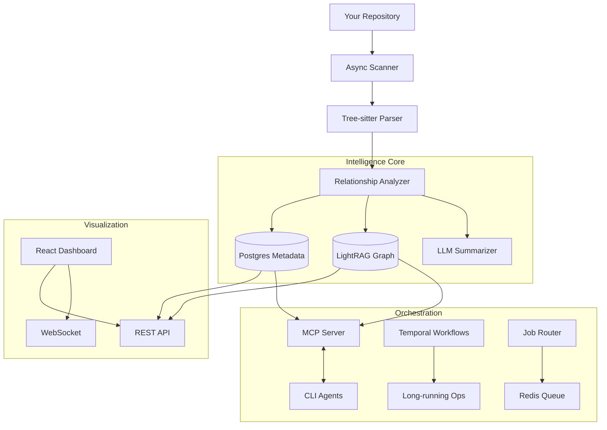

# 🚀 Docrunch System Preview

**Repositories aren't just code files anymore. They are living knowledge bases.**

This document provides a comprehensive walkthrough of the Docrunch system as built today, highlighting the integrated intelligence, orchestration, and visualization layers.

---

## 🏗️ System Architecture

Docrunch unifies **static analysis** (scanners/parsers) with **semantic intelligence** (LLMs/RAG) and **agentic workflows** (MCP/Temporal).

---

## 🧠 1. Core Intelligence Layer

The foundation of Docrunch is understanding your codebase better than any human can in a single sitting.

### **Polyglot Parsing via Tree-sitter**

Docrunch doesn't just read text; it builds Abstract Syntax Trees (ASTs).

- **Supported:** Python, TypeScript, JavaScript, TSX.
- **Extracts:** Classes, functions, imports, exports, and their exact line spans.
- **Benefit:** Precise context extraction without "hallucinated" lines.

### **Relationship Graph**

We map how code connects.

- **Import/Export Graph:** "What files import `auth.py`?"
- **Symbol References:** "Where is `UserSchema` used?"
- **LightRAG Integration:** A graph-based vector store that preserves the semantic web of your code, not just isolated chunks.

### **LLM Summaries**

Every file and function gets an AI-generated signature summary.

- Stored in Postgres for fast retrieval.
- Used to answer "What does this module do?" without reading the whole file.

---

## 🤖 2. The AI Orchestration Engine

Docrunch acts as the "Project Manager" for your AI agents.

### **Bidirectional MCP Server**

We implement the **Model Context Protocol (MCP)** to give agents tools:

- **Query Tools:** `search_docs` (RAG), `get_component` (AST lookup).
- **Report Tools:** `claim_task`, `log_finding`, `submit_completion`.
- **Impact:** Agents don't just "read code"; they _ask specific questions_ and _file reports_ on their work.

### **CLI Bridge**

Run your favorite CLI agents locally while giving them Docrunch superpowers.

- **Providers:** Gemini CLI, Claude CLI, Codex.
- **Modes:**
    - **Local:** Runs the CLI binary directly on your machine.
    - **Proxy:** expose local CLIs to dockerized containers via HTTP.
- **Result:** Use `claude` or `gh copilot` with deep context awareness.

---

## ⚡ 3. Operational Backbone

Robustness features designed for real-world development lifecycles.

### **Temporal Workflows**

Long-running tasks are safe from crashes.

- **Repo Scans:** Multi-step analysis pipelines.
- **Batch Embeddings:** Processing thousands of files reliably.
- **Saga Pattern:** Automatic rollback (compensation) if a step fails.

### **Offline Mode**

No internet? No API keys? No problem.

- **`docrunch scan --offline`**: Skips the fancy AI/DB stuff.
- **Fallback:** Uses local JSON cache to still generate useful Markdown docs.
- **Output:** Clean, navigable documentation for offline reading.

### **Storage Sync System**

An "Outbox Pattern" ensures consistency.

- Changes in Postgres emit events.
- Workers sync these changes to LightRAG and Markdown files.
- **Benefit:** Your documentation and vector index never drift from the database truth.

---

## 🖥️ 4. The Dashboard Experience

A React + Vite frontend that brings the data to life.

### **Knowledge Graph Visualizer**

_Navigate the brain of your code._

- Interactive node-link diagram of files and entities.
- Click to explore connections (imports, usage).
- Powered by React Flow and LightRAG.

### **Chat Interface**

_Talk to your codebase._

- **RAG-powered:** Answers grounded in your actual code and docs.
- **Citations:** Click a citation to jump to the exact file and line.
- **Event Stream:** Watch the system "think" via WebSocket updates.

### **Task Kanban Board**

_Manage AI work._

- Tracks tasks assigned to agents.
- **Columns:** Backlog -> Working -> Review -> Done.
- See exactly what every agent is working on in real-time.

---

## 🚦 5. Live Demo: The "Init to Insight" Flow

Here is how a developer uses Docrunch today:

1.  **Initialize**: `docrunch init` in a new repo. Sits alongside your code.
2.  **Scan**: `docrunch scan`. The terminal lights up with Rich progress bars as files are parsed and indexed.
3.  **Query**: `docrunch query "Where is auth logic?"`. Immediate, sourced answers.
4.  **Launch**: `docrunch serve`. The API and Dashboard spin up.
5.  **Explore**: Open `http://localhost:5173`.
    - Check the **Graph** to see dependency clusters.
    - Use **Chat** to draft a refactoring plan.
    - Create a **Task**: "Refactor Auth Middleware".
6.  **Execute**: Assign the task to **Claude CLI**.
    - Claude reads the plan via MCP.
    - Claude writes code.
    - Claude calls `submit_completion`.
7.  **Verify**: You see the task move to "Review" on the dashboard.

---

**Docrunch is ready to turn your repository into an intelligent partner.**
